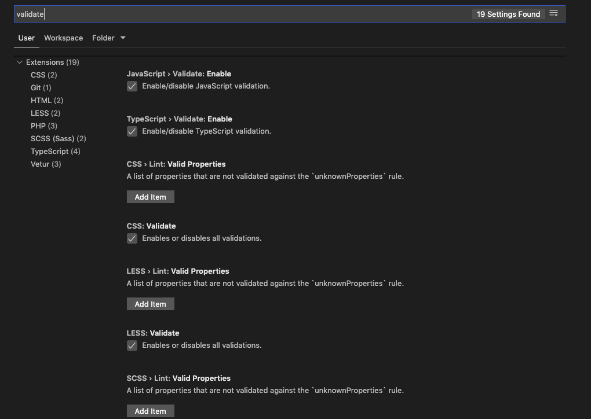
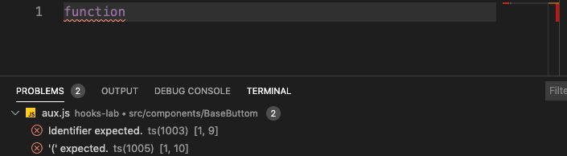
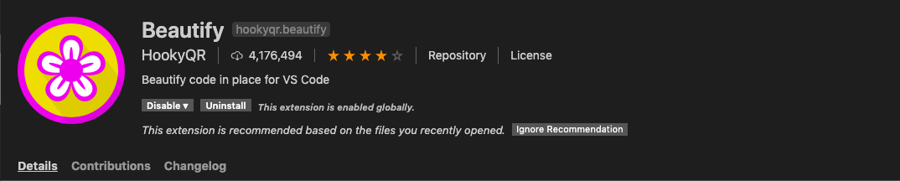
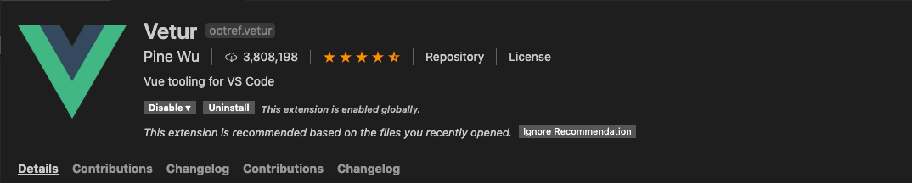
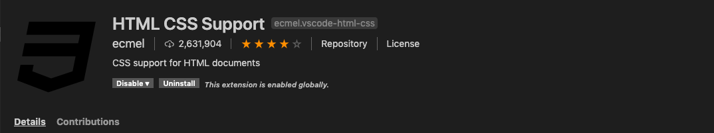
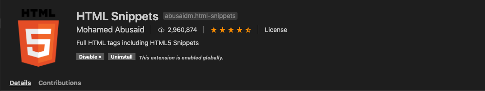
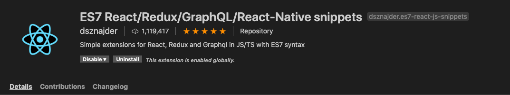

# 代码规范辅助工具全介绍

## 总纲

总的原则是通过各种约束代码规范的工具，更高效的提升整体团队的代码质量。

1. 更高效化的代码规范落地
2. 代码风格的团队化统一
3. 上线代码质量的严格控制
4. 辅助逐渐养成良好的代码习惯

### 从功能上分类

一般从功能上分类，代码质量辅助工具会有这么几种：

1. 语法检查：对JavaScript、CSS、HTML等语言的语法进行检查还有报错提示
2. 代码格式化：对于诸如缩进、冒号、分号等进行统一风格处理
3. 代码补全：提升开发效率，通过统一代码片段规范，统一代码风格
4. lint检查：代码提交的第一步，会对代码风格和语法等等进行检查

### 从工具上分类

1. vscode插件
2. npm插件

## 主要工具使用介绍

### vscode 插件使用介绍

#### 1、 vscode内置lint语法检查工具

我们团队前端开发推荐的开发工具是vscode（visual studio code），vscode工具集成了一些语法检查的功能，同学们也可以自己在setting中设置相关的属性。

一下例子是vscode对于一些语言进行语法检查时的报错

#### 2、 Beautify

Beautify 是一个功能十分强大的vscode 代码格式化插件。

3. Vetur & Vue VSCode Snippets

4. HTML CSS Support

5. HTML Snippets

6. ES7 React/Redux/GraphQL/React-Native snippets

### npm 插件使用介绍

eslint+husky+prettier+lint-staged 