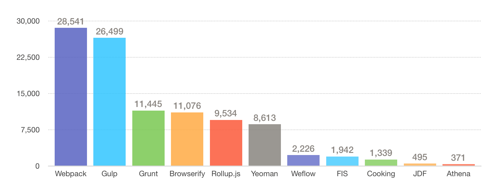
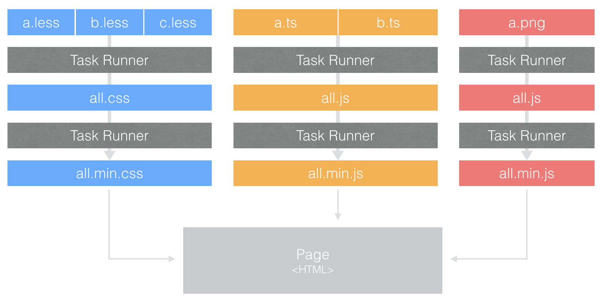
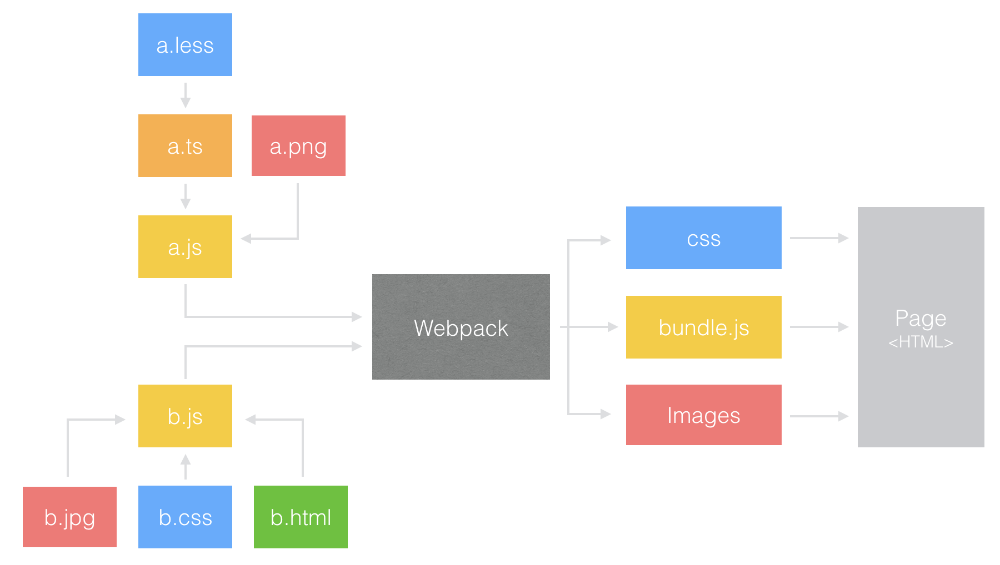

# 前端工程化——构建工具选型

## 一、什么是前端工程化

前端工程化是依据业务特点，将前端开发的规范、流程、技术、工具、经验等形成规范并建立成一种标准的体系。

## 二、为什么要前端工程化

实现前端工程化的目的简单来说就是通过流程规范、自动化工具来提升前端的开发效率、性能、质量、多人协作能力以及开发体验。
近几年前端仍保持较高的速度发展，前端开发面临着的流程、资源组织和协同开发等各方面的挑战，所以建立前端工程化是各个团队必经的成长过程。
但由于每个公司、每个团队甚至每个项目都有自己的特点，所以这里先暂时抛开规范、流程、技术这些主观的东西，从工具入手，聊聊工具的特性及适应场景，从而找到最适合自己团队项目的工程化方案。

## 三、构建工具

构建工具的主要功能就是实现自动化处理，例如对代码进行检查、预编译、合并、压缩；生成雪碧图、sourceMap、版本管理；运行单元测试、监控等，当然有的工具还提供模块化、组件化的开发流程功能。
网上各类的构建工具非常多，有家喻户晓的 Grunt、Gulp、Webpack，也有各大公司团队开源的构建工具，这里通过 Github 的 Star 数量来简单的对比下各个工具的流行度：

 

如果把工具按类型分可以分为这三类：

基于任务运行的工具：
Grunt、Gulp
它们会自动执行指定的任务，就像流水线，把资源放上去然后通过不同插件进行加工，它们包含活跃的社区，丰富的插件，能方便的打造各种工作流。
基于模块化打包的工具：
Browserify、Webpack、rollup.js
有过 Node.js 开发经历的应该对模块很熟悉，需要引用组件直接一个 require  就 OK，这类工具就是这个模式，还可以实现按需加载、异步加载模块。
整合型工具：
Yeoman、FIS、jdf、Athena、cooking、weflow
使用了多种技术栈实现的脚手架工具，好处是即开即用，缺点就是它们约束了技术选型，并且学习成本相对较高。

四、构建工具选型
在做选型的时候，我们往往会考虑以下几个因素：

是否符合团队的技术栈
是否符合项目需求
生态圈是否完善、社区是否活跃

还是排除 1、2 主观的因素，我们在不同类型的工具中选择几个热门（满足因素3），也就是：Grunt、Gulp、Webpack、Yeoman 看看它们的工作流、优劣点以及适用场景。
1、Grunt & Gulp
工作流：
这两款工具都是基于任务类型，所以它们的工作流是一致的：

 

可以看到它们打包的策略通常是 All in one，最后页面还是引用 css、img、js，开发流程与徒手开发相比并无差异。
特点与不足
Grunt
Grunt 是老牌的构建工具，特点是配置驱动，你需要做的就是了解各种插件的功能，然后把配置整合到 Gruntfile.js 中，可以看下面的配置例子，简单直接：

``` js
module.exports = function(grunt) {
  grunt.initConfig({
    jshint: {
      files: ['Gruntfile.js', 'src/**/*.js', 'test/**/*.js'],
      options: {
        globals: {
          jQuery: true
        }
      }
    },
    watch: {
      files: ['<%= jshint.files %>'],
      tasks: ['jshint']
    }
  });

  grunt.loadNpmTasks('grunt-contrib-jshint');
  grunt.loadNpmTasks('grunt-contrib-watch');

  grunt.registerTask('default', ['jshint']);
};
```

Grunt 缺点也是配置驱动，当任务非常多的情况下，试图用配置完成所有事简直就是个灾难；再就是它的 I/O 操作也是个弊病，它的每一次任务都需要从磁盘中读取文件，处理完后再写入到磁盘，例如：我想对多个 less 进行预编译、压缩操作，那么 Grunt 的操作就是：

> 读取 less 文件 -> 编译成 css -> 存储到磁盘 -> 读取 css -> 压缩处理 -> 存储到磁盘

这样一来当资源文件较多，任务较复杂的时候性能就是个问题了。

Gulp
Gulp 特点是代码驱动，写任务就和写普通的 Node.js 代码一样：

```js
var gulp = require('gulp');
var pug = require('gulp-pug');
var less = require('gulp-less');
var minifyCSS = require('gulp-csso');

gulp.task('html', function(){
  return gulp.src('client/templates/*.pug')
    .pipe(pug())
    .pipe(gulp.dest('build/html'))
});

gulp.task('css', function(){
  return gulp.src('client/templates/*.less')
    .pipe(less())
    .pipe(minifyCSS())
    .pipe(gulp.dest('build/css'))
});

gulp.task('default', [ 'html', 'css' ]);
```

再一个对文件读取是流式操作（Stream），也就是说一次 I/O 可以处理多个任务，还是 less 的例子，Gulp 的流程就是：

> 读取 less 文件 -> 编译成 css -> 压缩处理 -> 存储到磁盘

Gulp 作为任务类型的工具没有明显的缺点，唯一的问题可能就是完成相同的任务它需要写的代码更多一些，所以除非是项目有历史包袱（原有项目就是基于 Grunt 构建）在 Grunt 与 Gulp 对比看来还是比较推荐 Gulp！
适用场景：
通过上面的介绍可以看出它们侧重对整个过程的控制管理，实现简单、对架构无要求、不改变开发模式，所以非常适合前端、小型、需要快速启动的项目。
2、Webpack
Webpack 是目前最热门的前端资源模块化管理和打包工具，还是先通过一张图大致了解它的运行方式：
工作流

 

特点与不足
Webpack 的特点：

把一切都视为模块：不管是 CSS、JS、Image 还是 HTML 都可以互相引用，通过定义 entry.js，对所有依赖的文件进行跟踪，将各个模块通过 loader 和 plugins 处理，然后打包在一起。
按需加载：打包过程中 Webpack 通过 Code Splitting 功能将文件分为多个 chunks，还可以将重复的部分单独提取出来作为 commonChunk，从而实现按需加载。

Webpack 也是通过配置来实现管理，与 Grunt 不同的时，它包含的许多自动化的黑盒操作所以配置起来会简单很多（但遇到问题调试起来就很麻烦），一个典型的配置如下：

```js
module.exports = {
    //插件项
    plugins: [commonsPlugin],
    //页面入口文件配置
    entry: {
        index : './src/js/page/index.js'
    },
    //入口文件输出配置
    output: {
        path: 'dist/js/page',
        filename: '[name].js'
    },
    module: {
        //加载器配置
        loaders: [
            { test: /\.css$/, loader: 'style-loader!css-loader' },
            { test: /\.js$/, loader: 'jsx-loader?harmony' },
            { test: /\.scss$/, loader: 'style!css!sass?sourceMap'},
            { test: /\.(png|jpg)$/, loader: 'url-loader?limit=8192'}
        ]
    },
    //其它解决方案配置
    resolve: {
        root: '/Users/Bell/github/flux-example/src', //绝对路径
        extensions: ['', '.js', '.json', '.scss'],
        alias: {
            AppStore : 'js/stores/AppStores.js',
            ActionType : 'js/actions/ActionType.js',
            AppAction : 'js/actions/AppAction.js'
        }
    }
};
```

Webpack 的不足：

上手比较难：官方文档混乱、配置复杂、难以调试（Webpack2 已经好了很多）对于新手而言需要经历踩坑的过程；
对于 Server 端渲染的多页应用有点力不从心：Webpack 的最初设计就是针对 SPA，所以在处理 Server 端渲染的多页应用时，不管你如何 chunk，总不能真正达到按需加载的地步，往往要去考虑如何提取公共文件才能达到最优状态。

模块化与组件化
提到 Webpack 就不得不说它的模块化加载方式，先来看下传统的模块化方式：

```text
├── scripts/
│    ├── dropdown.js
│    ├── lazyload.js
│    ├── modal.js
│    └── slider.js
├── styles/
│    ├── button.less
│    ├── list.less
│    ├── modal.less
│    └── slider.less
```

传统的模块化基于单种编程语言，目的是为了解耦和重用，而因为前端本身的特点（需要三种编程语言配合）以及能力限制，所以不能实现跨资源加载也就难以实现组件化。
而 Webpack 打破的这种思维局限，它的 Require anything 的理念在实现模块化的同时也能够很方便实现组件化，借助 Webpack 就可以很轻松的实现这种代码组织结构：

``` test
├──components/
│    ├── button/
│    │    ├── button.js
│    │    ├── button.less
│    │    ├── dropdwon.js
│    │    └── icon.png
│    ├── modal/
│    ├── slider/
```

一旦实现组件化，那么我们的项目开发方式和分工合作方式就可以升级，可以实现分组件并行开发，也可以方便的引用其它项目使用的组件：

So，可以说组件化才是目前提升大型项目多人团队合作效率的最佳解决方案！
适用场景：
综上所述，Webpack 特别适合配合 React.js、Vue.js 构建单页面应用以及需要多人合作的大型项目，在规范流程都已约定好的情况下往往能极大的提升开发效率与开发体验。
OK，对于前端工程工具的介绍就到这里，希望能在大家做技术选型的时候给予一定的帮助；接下来还会带来 Gulp、Webpack 在实际工作应用的详细教程。
