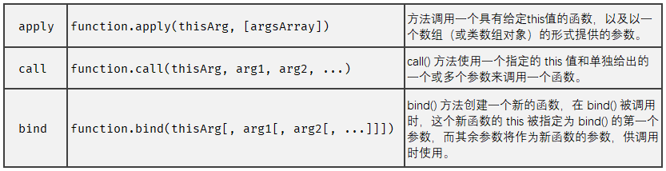

# JavaScript 中函数的方方面面

## 声明函数

在 ECMAScript 中，创建函数的最常用的两个方法是函数表达式和函数声明，两者期间的区别是有点晕，因为 ECMA 规范只明确了一点：函数声明必须带有标示符（Identifier）（就是大家常说的函数名称），而函数表达式则可以省略这个标示符：

在使用函数之前，我们首先要声明(或定义)函数，JavaScript 中声明函数有三种方式，我先简单介绍，后面逐一详细分析区别。

> 1. 函数声明 `function name([param[, param[, ... param]]]) { statements }`
> 2. 函数表达式 `var myFunction = function name([param[, param[, ... param]]]) { statements }`
> 3. 函数生成器声明 `function* name([param[, param[, ...param]]]) { statements }`
> 4. 函数生成器表达式 `function* [name]([param] [, param] [..., param]) { statements }`
> 5. 箭头函数表达式 `([param] [, param]) => { statements } param => expression`
> 6. Function 构造函数 `new Function (arg1, arg2, ... argN, functionBody)`

### 函数声明

```js
function sum(x, y) {
  return x + y;
}
```

关于函数声明，它最重要的一个特征就是函数声明提升(function declaration hoisting)，意思是执行代码之前先读取函数声明。这意味着可以把函数声明放在调用它的语句之后。如下代码可以正确执行：

```js
sum(2, 3); // 5

function sum(x, y) {
  return x + y;
}
```

### 函数表达式

```js
const sum = function (x, y) {
  return x + y;
};

sum(2, 3); // 5
```

首先要注意的是函数表达式不存在

不同关键字的区别 var let const

函数表达式如果是声明前调用的，就会出现跟函数声明不一样情形，出现了报错。追根究底是因为函数表达式是将一个匿名函数赋值给了对象。所以这里在 JavaScript 上下文初始化的时候发生的是变量提升，所以在运行 typeof sum 会给出 undefined ，跟提前使用声明的变量一样的情况。

```js
typeof sum; // undefined
sum(2, 3); // Uncaught TypeError: sum is not a function

var sum = function (x, y) {
  return x + y;
};
```

ES6 时代的到来，声明变量的关键字多出了 let const，函数表达式跟一般声明变量的表达式没什么区别，所以要注意的问题也相似。let、const 拥有了块级作用域，const 声明的变量引用无法改变等，同样适用于函数表达式。

```js
sum(2, 3); // Uncaught ReferenceError: Cannot access 'sum' before initialization

const sum = function (x, y) {
  return x + y;
};
```

日常开发中，我比较喜欢在函数表达式中用 const 表达式，保持声明的变量对匿名函数的引用。

## 匿名函数和立即执行函数

Lambda 表达式（lambda expression）是一个匿名函数，Lambda 表达式基于数学中的 λ 演算得名，直接对应于其中的 lambda 抽象（lambda abstraction），是一个匿名函数，即没有函数名的函数。Lambda 表达式可以表示闭包（注意和数学传统意义上的不同）。

参数列表 => 语句或语句块

```js
x => x + 1                              // Implicitly typed, expression body
x => { return x + 1; }                  // Implicitly typed, statement body
(int x) => x + 1                        // Explicitly typed, expression body
(int x) => { return x + 1; }            // Explicitly typed, statement body
(x, y) => x * y                         // Multiple parameters
() => Console.WriteLine()               // No parameters
async (t1,t2) => await t1 + await t2    // Async
delegate (int x) { return x + 1; }      // Anonymous method expression
delegate { return 1 + 1; }              // Parameter list omitted
```

匿名函数 `(anonymous function)` 最早是 LISP 语言引入，后面发展为不仅是函数式语言所特有，在解释型语言和编译型语言中也越来越多匿名函数的身影，或许有个更潮的名字叫 `lambda` 表达式。

闭包多是用匿名函数实现，在匿名函数中引用了外部变量，那这个匿名函数就形成了闭包。由于闭包和匿名函数之间有着千丝万缕的关系，所以经常会把两者搞混淆。其实在 Js 中匿名函数、闭包、自执行函数、回调函数、箭头函数，这些概念似乎相同，却又不同，请读者朋友自行了解。

匿名函数拥有可动态编程的执行过程。巧妙使用可以让你的代码简约而不失优雅，灵活而不失约束。好了，正式切入本文的正题，巧用匿名函数重构代码。按照重构的惯例，先指出代码中的坏味（Bad Smell）：

定义冗长的重复配置
条件多变的集合过滤
说一不二的方法调用

### 立即执行函数

在这篇帖子里，我们一直叫自执行函数，确切的说是自执行匿名函数（Self-executing anonymous function），但英文原文作者一直倡议使用立即调用的函数表达式（Immediately-Invoked Function Expression）这一名称，作者又举了一堆例子来解释，好吧，我们来看看：

```
// 下面2个括弧()都会立即执行

(function () { /* code */ } ()); // 推荐使用这个
(function () { /* code */ })(); // 但是这个也是可以用的

// 由于括弧()和JS的&&，异或，逗号等操作符是在函数表达式和函数声明上消除歧义的
// 所以一旦解析器知道其中一个已经是表达式了，其它的也都默认为表达式了
// 不过，请注意下一章节的内容解释

var i = function () { return 10; } ();
true && function () { /* code */ } ();
0, function () { /* code */ } ();

// 如果你不在意返回值，或者不怕难以阅读
// 你甚至可以在function前面加一元操作符号

!function () { /* code */ } ();
~function () { /* code */ } ();
-function () { /* code */ } ();
+function () { /* code */ } ();

// 还有一个情况，使用new关键字,也可以用，但我不确定它的效率
// http://twitter.com/kuvos/status/18209252090847232

new function () { /* code */ }
new function () { /* code */ } () // 如果需要传递参数，只需要加上括弧()
```

```js
(function () {
  // 这里是块级作用域
})();
```

## 函数参数

### 参数个数

JavaScript 真的是非常灵活的语言。在声明函数参数（这里是形参）的时候，不用在意传递参数的个数，甚至不用传也可以(其实是有个最大个数的限制，一个函数最多可以有 255 个参数)。另一方面，JavaScript 对函数参数的类型也不做校验，因此在调用的时候（这里是实参），传递的参数理论上可以是任何类型。

JavaScript 函数参数另外一个灵活的地方在于，在调用函数的时候，JavaScript 完全不会对参数个数和类型，跟声明的时候做对比检查。

```js
function sum(x, y) {
  return x + y;
}
sum(); // NaN

function greet() {
  console.info('Hello World.');
}

greet('Martin'); // Hello World.
```

理论上上面这么做，没有任何问题，但肯定是不值得提倡的，后面我们可以尝试用 arguments 这个对象对函数 不定参数 这个特性加以利用。

还有一种情况是实参要比声明函数时的参数（形参）数量要少，要么缺少的参数会被设置为 undefined。

```js
funciton print(x, y) {
  console.info(x, y)
}
print(1) // 1 undefined
```

实际上，调用的时候传参缺省在日常开发开发中非常常见，为了代码健壮性的考虑要做设置的必要的参数默认值。并且实际做法在 ES2015 推出之前有着不同写法。

```js
// ES2015 之前
function greet(name, age) {
  name = name || 'Martin';
  age = age || 18;
  console.info("Hello, I'm " + name + ". I'm " + age + ' years old.');
}

// ES2015 的写法
function greet(name = 'Martin', age = 18) {
  console.info(`Hello, I'm ${name}. I'm ${age} years old`);
}
```

实际上，使用 y || 2 是不严谨的，显式地设置假值(undefined、null、false、0、-0、”、NaN)也会得到相同的结果。所以应该根据实际场景进行合理设置。更多设置默认参数的方法。

上面两个例子是我日常开发中最常用到的(ES2015 之前的方式现在也不常用了)。下面将一些不常用的全部列举出来。

```js
// 有形参和无形参，效果一样。
function add() {
  var a = arguments[0] ? arguments[0] : 1;
  var b = arguments[1] ? arguments[1] : 2;
  return a + b;
}
function add(a, b) {
  var a = arguments[0] ? arguments[0] : 1;
  var b = arguments[1] ? arguments[1] : 2;
  return a + b;
}

// 跟上面 name = name || 'Martin' 写法类似
function greet(name = 'Martin', age = 18) {
  if (!name) name = 'Martin';
  if (!age) age = 18;
  console.info("Hello, I'm " + name + ". I'm " + age + ' years old.');
}
```

### 同名参数

在非严格模式下，函数中可以出现同名形参，且只能访问最后出现的该名称的形参。

```js
function add(x, x, x) {
  return x;
}
console.log(add(1, 2, 3)); //3
```

而在严格模式下，出现同名形参会抛出语法错误

```js
function add(x, x, x) {
  'use strict';
  return x;
}
console.log(add(1, 2, 3)); //SyntaxError: Duplicate parameter name not allowed in this context
```

### 函数的形参与实参

> - Parameters(形参) 是函数定义时的形式参数，作为函数定义的一部分，是列出类的变量，作用为接收函数调用时的实参。
> - Arguments(实参) 是函数调用时的实际参数，是在函数被调用时传递给该函数的变量值。实参可以为变量、常量、函数、表达式等。

在 JavaScript 中实参与形参数量并不需要像 JAVA 一样必须在数量上严格保持一致，具有很大的灵活性。如果函数调用期间传递的 arguments(实参) 数量和函数定义中列出的 parameters(形参) 数量不同，JavaScript 不会抛出错误。我们应该清楚的是， parameters(形参) 和 arguments(实参) 应该被视为两个不同的实体来对待。

如下：

```js
function test(str1, str2, str3) {
  // ......
}
test(); // str1: undefined, str2: undefined, str3: undefined
test('hello'); // str1: 'hello', str2: undefined, str3: undefined
test('hello', 'world'); // str1: 'hello', str2: 'world', str3: undefined
test('hello', 'world', '!'); // str1: 'hello', str2: 'world', str3: '!'
```

在 JavaScript 代码运行过程中，形参的作用为接收实参，它们两个分别位于不同的内存地址中，大致可以分为两种情况：

实参为原始值。当实参为原始值时,此时形参为实参的拷贝。因此，函数体内形参值的改变并不会影响实参。

```js
function test(str) {
  str = 'chinese';
  return str;
}
const str1 = 'china';
const str2 = test(str1);
console.log(str1); // china
console.log(str2); // chinese
```

实参为引用值。当实参为引用值时，此时形参为实参内存地址的拷贝。因此，函数体内形参值的变化在一定情况下将会影响实参。

```js
function test(obj) {
  // 形参obj的值实际上为实参obj的内存引用，及形参与实参同时指向同一个内存地址。
  obj.name = 'typeScript'; // 此时改变的为形参与实参同时指向的那个内存地址中的值
  // 所以此时也导致实参的name属性发生了变化
  obj = {
    // 此时对形参obj进行重新赋值，给予了它一个新的内存地址
    name: 'react', // 从此之后的形参将于实参完全解绑，两者之前不再存在联系
    star: 13000,
  };
  obj.star = 20000; // 所以这里仅仅是改变了形参的star属性
  return obj;
}
const obj1 = {
  name: 'javaScript',
  star: 100000,
};
const obj2 = test(obj1);
console.log(obj1); // name: 'typeScript', star: 100000
console.log(obj2); // name: 'react', star: 20000
```

### arguments 对象

JavaScript 函数内部有一个 arguments 对象，该对象算是蛮重要的一个概念。

> arguments 是一个对应于传递给函数的参数的类数组对象。
> 类数组这个概念的意思是，arguments 对象拥有 length 属性和从 0 开始的下标属性，但是它没有内置对象 Array 那样拥有诸如 forEach() 方法和 map() 方法。

arguments 对象是所有（非箭头）函数中都可用的局部变量。我们可以使用 arguments 对象在函数中引用函数的参数。此对象包含传递给函数的每个参数，第一个参数在索引 0 处。上文中我们说到函数 不定参数 的概念，对于声明时未传递参数，调用时却传递参数这种情况，arguments 就有了用武之地。下面代码运行起来没有任何差别

```js
function func1(a, b, c) {
  console.log(arguments[0]); // 1
  console.log(arguments[1]); // 2
  console.log(arguments[2]); // 3
}
func1(1, 2, 3);

function func2() {
  console.log(arguments[0]); // 1
  console.log(arguments[1]); // 2
  console.log(arguments[2]); // 3
}
func2(1, 2, 3);
```

参数也可以被设置：

```js
arguments[1] = 'new value';
```

arguments 对象不是一个 Array 。它类似于 Array，但除了 length 属性和索引元素之外没有任何 Array 属性。例如，它没有 pop 方法。但是它可以被转换为一个真正的 Array：

```js
// ES2015 之前
var args = Array.prototype.slice.call(arguments);
var args = [].slice.call(arguments);

// ES2015
const args = Array.from(arguments);
const args = [...arguments];
```

arguments 对象的 length 属性显示实参的个数，函数的 length 属性显示形参的个数。

```js
function add(x, y) {
  console.info(arguments.length); //3
  return x + 1;
}
add(1, 2, 3);
console.info(add.length); //2
```

### arguments 属性

> - arguments.callee 指向参数所属的当前执行的函数。
> - arguments.length 传递给函数的参数数量。
> - arguments[@@iterator] 返回一个新的 Array 迭代器 对象，该对象包含参数中每个索引的值。

```js
function factorial(num) {
  if (num <= 1) {
    return 1;
  } else {
    return num * factorial(num - 1);
  }
}
```

```js
function factorial(num) {
  if (num <= 1) {
    return 1;
  } else {
    return num * arguments.callee(num - 1);
  }
}
```

```js
function factorial(num) {
  'use strict';
  if (num <= 1) {
    return 1;
  } else {
    return num * arguments.callee(num - 1);
  }
}
//TypeError: 'caller', 'callee', and 'arguments' properties may not be accessed on strict mode functions or the arguments objects for calls to them
console.log(factorial(5));
```

```js
var factorial = function fn(num) {
  if (num <= 1) {
    return 1;
  } else {
    return num * fn(num - 1);
  }
};
```

**arguments.caller**

```js
function inner(x) {
  console.log(arguments.caller); //undefined
}
inner(1);
```

同样地，在严格模式下，访问这个属性会抛出 TypeError 错误

```js
function inner(x) {
  'use strict';
  //TypeError: 'caller' and 'arguments' are restricted function properties and cannot be accessed in this context
  console.log(arguments.caller);
}
inner(1);
```

### 参数传递

javascript 中所有函数的参数都是按值传递的。也就是说，把函数外部的值复制到函数内部的参数，就和把值从一个变量复制到另一个变量一样

基本类型值：在向参数传递基本类型的值时，被传递的值会被复制给一个局部变量(命名参数或 arguments 对象的一个元素)

```js
function addTen(num) {
  num += 10;
  return num;
}
var count = 20;
var result = addTen(count);
console.log(count); //20，没有变化
console.log(result); //30
```

引用类型值：在向参数传递引用类型的值时，会把这个值在内存中的地址复制给一个局部变量，因此这个局部变量的变化会反映在函数的外部

```js
function setName(obj) {
  obj.name = 'test';
}
var person = new Object();
setName(person);
console.log(person.name); //'test'
```

当在函数内部重写引用类型的形参时，这个变量引用的就是一个局部对象了。而这个局部对象会在函数执行完毕后立即被销毁

```js
function setName(obj) {
  obj.name = 'test';
  console.log(person.name); //'test'
  obj = new Object();
  obj.name = 'white';
  console.log(person.name); //'test'
}
var person = new Object();
console.log(person.name); //undefined
setName(person);
console.log(person.name); //'test'
```

### 用法实例

**遍历参数求和**

这个也是典型的 不定参数 的用法，声明时不指定参数的个数，而是在调用时根据需要传递参数。

```js
function add() {
  var sum = 0,
    len = arguments.length;
  for (var i = 0; i < len; i++) {
    sum += arguments[i];
  }
  return sum;
}
```

这个代码可以使用 ES6 剩余参数的新特性，优化的更加简洁。

```js
function sum(...args) {
  return args.reduce((acc, curr) => acc + curr);
}
```

剩余参数和 `arguments` 对象之间的区别主要有三个：

- 剩余参数只包含那些没有对应形参的实参，而 `arguments` 对象包含了传给函数的所有实参。
- `arguments` 对象不是一个真正的数组，而剩余参数是真正的 `Array` 实例。
- `arguments` 对象还有一些附加的属性 （如 `callee` 属性）。

**定义连接字符串的函数**

```js
function myConcat(separator) {
  var args = Array.prototype.slice.call(arguments, 1);
  return args.join(separator);
}
```

### 函数的重载

javascript 函数不能像传统意义上那样实现重载。而在其他语言中，可以为一个函数编写两个定义，只要这两个定义的签名(接受的参数的类型和数量)不同即可
javascript 函数没有签名，因为其参数是由包含 0 或多个值的数组来表示的。而没有函数签名，真正的重载是不可能做到的。

```js
//后面的声明覆盖了前面的声明
function addSomeNumber(num) {
  return num + 100;
}
function addSomeNumber(num) {
  return num + 200;
}
var result = addSomeNumber(100); //300
```

只能通过检查传入函数中参数的类型和数量并作出不同的反应，来模仿方法的重载

```js
function doAdd() {
  if (arguments.length == 1) {
    alert(arguments[0] + 10);
  } else if (arguments.length == 2) {
    alert(arguments[0] + arguments[1]);
  }
}
doAdd(10); //20
doAdd(30, 20); //50
```

## this

## 函数原型方法

> - Function.prototype.apply()
> - Function.prototype.bind()
> - Function.prototype.call()
> - Function.prototype.toString() 返回一个表示当前函数源代码的字符串。很简单，本文不做深入探讨。

上面我们花了不少的篇幅简绍 this 关键字，在JavaScript 函数中十分重要，改变 function 也提供了改变 this 指向的方法。



## 箭头函数

## 柯里化

`function curry() {}`

## 高阶函数

function

## 函数组合

## 参考文章

- [第八章：Javascript 函数](https://www.cnblogs.com/ahthw/p/4282745.html)
- [杂七杂八 JS ：深入理解 函数、匿名函数、自执行函数](https://blog.csdn.net/xixiruyiruyi/article/details/54894404)
- [JavaScript 中 arguments.callee 的代替用法](https://www.jianshu.com/p/72a590f59f4f)
- [Parameters(形参) 和 Arguments(实参) ](https://www.html.cn/archives/8057)
