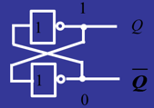

# JavaScript执行机制深度解析——内存管理(Memory Management)

## 什么是内存？

在谈及内存管理之前，有个问题是：什么是内存？

触发器  


在硬件层面，计算机内存是由大量触发电路组成的。每个触发电路包含了一些晶体管并且能够存储一个位（bit）。单个触发器可通过唯一的标识符寻址，因此我们可以读取并重写它们。因此，在概念上，我们可以将整个计算机内存看作时我们可以读和写的一个由位组成的大数组。

因为人类并不擅长用位进行思考（位-> bit，这就像人类不擅长二进制，采用十进制），所以我们将位组成更大的组，它们可以一起用来表示数字。8位(bit)称为1字节（byte）。除了字节之外，还有字（有时是 16 位(bit)，有时是 32 位(bit)）。

很多东西都存储在内存中：

* 所有程序使用的所有变量和其他数据。
* 程序的代码，包括操作系统的。

编译器和操作系统共同合作，帮助我们管理内存。

编译代码时，编译器可以检查原始数据类型，并提前计算出需要多少内存。然后将所需的数量分配给调用堆栈中的程序。这些变量分配的空间称为堆栈空间，因为随着函数被调用，它们的内存被添加到现有存储器的顶部。当它们终止时，它们以 LIFO （last-in，first-out）顺序被移除。例如，考虑以下声明：

```js
int n; // 4 bytes
int x[4]; // array of 4 elements, each 4 bytes
double m; // 8 bytes
```

编译器立即会看到这段代码需要：
4 + 4x4 + 8 = 28 bytes。

> 这是现在整数和双精度的工作原理。大约 20 年前，整数通常为 2 字节，双精度为 4 字节。你的代码应该永远不依赖于此时基本数据类型的大小。

编译器将插入与操作系统交互的代码，以便在堆栈中请求要存储的变量所需的字节数。

在上面的示例中，编译器知道每个变量的精确内存地址。事实上，每当我们写入变量 n 时，在系统内部都会被翻译为“内存地址 4127963” 这样的东西。

注意，如果我们这里尝试访问 x[4] ，我们可能会访问到和 m 相关联的数据。这是因为我们访问的元素在数组中并不存在——这 4 个字节比数组中最后一个元素 x[3] 还要远，可能会读取（或重写） m 的位。这肯定会对程序产生难以理解的不良影响。

当函数调用其他函数时，每个函数在调用时都会获得自己的堆栈块。它保存所有的局部变量，还有一个程序计数器，可以记住函数在执行中的位置。当函数执行完成时，其内存块可以再次用于其他目的。

## 内存分配


引用资料：  
* [MDN-内存管理][1]
* [JavaScript 工作原理（一）——内存管理与四种常见内存泄漏的处理方法][2]
* [How JavaScript works: memory management + how to handle 4 common memory leaks][9]
* [4种JavaScript的内存泄露及避免方法][3]
* [JavaScript如何工作：V8引擎深入探究 + 优化代码的5个技巧（译文）][4]
* [JavaScript内存分配][5]
* [js中的栈、堆、队列、内存空间][6]
* [javascript内存管理（堆和栈）和javascript运行机制][7]
* 

[1]: https://developer.mozilla.org/zh-CN/docs/Web/JavaScript/Memory_Management
[2]: https://blog.csdn.net/tangxiaolang101/article/details/78113871
[3]: https://blog.csdn.net/web_lc/article/details/72920029
[4]: https://segmentfault.com/a/1190000011289535
[5]: https://blog.csdn.net/aomize/article/details/70747509
[6]: https://www.cnblogs.com/slly/p/10366290.html
[7]: https://www.cnblogs.com/web-easy/p/7889184.html
[9]: https://blog.sessionstack.com/how-javascript-works-memory-management-how-to-handle-4-common-memory-leaks-3f28b94cfbec
