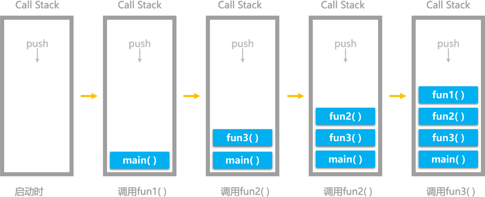

# JavaScript执行机制深度解析——调用栈、异步队列和事件循环(Event Loop)

JavaScript是啥？是门编程语言。既然是编程语言，那它就能运行，运行时就要遵循一定的规则，有着一些特定的运行机制。

* 解释调用栈是什么东西
* 举例展示调用栈是如何工作的
* 直接放图，解释Event Loop，分析过程
* 实例解析该过程，分析一些细节性的内容

学习和使用JavaScript这门语言眼看着也有了两年时光，一直以来对于JavaScript的运行机制不甚了解，  
一方面是自己对于语言底层的东西很感兴趣，另一方面，这些知识也给开发带来更多的助力（虽然表面上看上去没怎么用到。）

这篇文章主要阐述执行上下文、调用栈、异步队列、事件之间的关系

## 关键词
* Call Stack：调用栈
* Event Table：异步事件表
* Event Queue：异步事件队列
* Event Loop：事件循环
* Callback Queue: 回调队列

## 一切从执行栈开始
  
> factorial函数是一个理解调用栈难度适中的函数

关于执行栈，这其实并不是JavaScript专有的知识 ，计算机语言的执行几乎都是依赖于执行栈的。

> 执行栈是计算机科学中存储有关正在运行的子程序的消息的栈。经常被用于存放子程序的返回地址。在调用任何子程序时，主程序都必须暂存子程序运行完毕后应该返回到的地址。因此，如果被调用的子程序还要调用其他的子程序，其自身的返回地址就必须存入执行栈，在其自身运行完毕后再行取回。在递归程序中，每一层次递归都必须在执行栈上增加一条地址，因此如果程序出现无限递归（或仅仅是过多的递归层次），执行栈就会产生栈溢出。

关于执行栈的称呼或者说别名有很多种：
* 执行栈（Execution stack）
* 调用栈（Call stack）
* 控制栈（Control stack）
* 运行时栈（Run-time stack）
* 机器栈（Machine stack）

以上名词所要表达的都是一个意思，下文中指定使用 **执行栈** 表达

### **功能**

调用栈的主要功能是存放返回地址。除此之外，调用栈还用于存放：
* 本地变量：子程序的变量可以存入调用栈，这样可以达到不同子程序间变量分离开的作用。
* 参数传递：如果寄存器不足以容纳子程序的参数，可以在调用栈上存入参数。
* 环境传递：有些语言（如Pascal与Ada）支持“多层子程序”，即子程序中可以利用主程序的本地变量。这些变量可以通过调用栈传入子程序。

下面是段代码示例
```js
function func1() {
  console.log('in function1');
}

function func2() {
  func1();
  console.log('in function2');
}

function func3() {
  func2();
  console.log('in function3');
}

func3();
```



## 调用栈和Event Loop

JavaScript执行栈示意图（图-2）  


如果你暂时看不懂这个图，没有关系，让我们先学习铺垫知识。

### 关于JavaScript单线程这件事情

首先要提的是：JavaScript这一门单线程的语言（一段时间内只能做一件事）。

  

有必要解释一下JavaScript设计之初为什么是单线程语言。举个简单的例子，假定JavaScript同时有两个线程，一个线程在某个DOM节点上添加内容，另一个线程删除了这个节点，这时浏览器应该以哪个线程为准？ 所以，为了避免复杂性，从一诞生，JavaScript就是单线程，这已经成了这门语言的核心特征 。

单线程就意味着，所有任务需要排队，前一个任务结束，才会执行后一个任务。如果前一个任务耗时很长，后一个任务就不得不一直等着。

如果排队是因为计算量大，CPU忙不过来，倒也算了，但是很多时候CPU是闲着的，因为IO设备（输入输出设备）很慢（比如Ajax操作从网络读取数据），不得不等着结果出来，再往下执行。

JavaScript语言的设计者意识到，这时主线程完全可以不管IO设备，挂起处于等待中的任务，先运行排在后面的任务。等到IO设备返回了结果，再回过头，把挂起的任务继续执行下去。

于是，所有任务可以分成两种，一种是**同步任务（synchronous）**，另一种是**异步任务（asynchronous）**。
* 同步任务指的是，在主线程上排队执行的任务，只有前一个任务执行完毕，才能执行后一个任务；
* 异步任务指的是，不进入主线程、而进入"任务队列"（task queue）的任务，只有"任务队列"通知主线程，某个异步任务可以执行了，该任务才会进入主线程执行。

上面提到异步任务会被放在任务队列里面，在js中其实有两类任务队列：宏任务队列（macro tasks）和微任务队列（micro tasks）。宏任务队列可以有多个，微任务队列只有一个。那么什么任务，会分到哪个队列呢？

macrotask任务队列的来源有：
* setTimeout
* setInterval
* setImmediate
* I/O
* UI rendering

microtask任务队列的来源有：
* process.nextTick
* promises
* Object.observe
* MutationObserver

我们经常会听到引擎和runtime，它们的区别是什么呢？

* 引擎：解释并编译代码，让它变成能交给机器运行的代码（runnable commands）。
* runtime：就是运行环境，它提供一些对外接口供Js调用，以跟外界打交道，比如，浏览器环境、Node.js环境。不同的runtime，会提供不同的接口，比如，在 Node.js 环境中，我们可以通过 require 来引入模块；而在浏览器中，我们有 window、 DOM。

> JS引擎中负责解释和执行JavaScript代码的线程只有一个，就叫做主线程，实际上还有其它的线程，例如处理AJAX请求的线程、处理DOM事件的线程、定时器线程等等，他们叫做工作线程。

JS引擎执行JavaScript代码的主线程会被分配一个stack，这就是**同步执行栈**，也叫做调用栈（call stack），同时JS引擎还会维护一个异步队列，用于维护异步事件，这就是**异步队列**（event queue）。在JavaScript存在一些Web APIs，这些API天生就是异步的。例如：。。。。。。。

Event Loop闪亮登场
既然JavaScript是单线程，那么面对异步事件诸如定时器、网络请求、I/O操作、DOM event等，JavaScript该怎么办？这时候就该Event Loop登场来处理上述异步事件。

所谓"回调函数"（callback），就是那些会被主线程挂起来的代码。异步任务必须指定回调函数，当主线程开始执行异步任务，就是执行对应的回调函数。

"任务队列"是一个先进先出的数据结构，排在前面的事件，优先被主线程读取。主线程的读取过程基本上是自动的，只要执行栈一清空，"任务队列"上第一位的事件就自动进入主线程。但是，由于存在后文提到的"定时器"功能，主线程首先要检查一下执行时间，某些事件只有到了规定的时间，才能返回主线程。

现在回过头在看（图-2），我们就能看懂JavaScript运行机制大概是怎么回事。

但其实，问题远没有这么简单：（图-2）中实际对于Event Loop的解释我是不满意的，因为并没有对于循环有着充分理解。


1. 创建call stack和heap， 初始化全局执行上下文，执行代码；
2. js引擎自上而下执行代码，主线程遇到Web APIs时，相应的工作线程接收请求并告知主线程已收到，返回异步函数并将回调函数放到Event Table中(这是一个注册过程)；
3. 主线程继续执行代码，工作线程完成工作后，Event Table会将这个函数移到Event Queue，Event Queue是个缓冲区域，这里的函数等着被调用并移到调用栈；
4. js引擎存在monitoring process进程，会持续不断的检查主线程执行栈是否为空，一旦为空,它会检查Event Queue里边是否有等待被调用的函数，检测到有排队的回调函数，会push到call stack，继续执行。


上图可以很好的说明同步执行栈和异步队列的关系，已经js引擎主线程与异步线程之间的关系。


**以上就是Event Loop执行的大致过程。**

来一个实例。。。

```js
setTimeout(function(){
  console.info('shaogucheng');
}, 0);
while (true) {
  let a;
}
```

```js
console.log(1);
setTimeout(function(){console.log(2);}, 0);
console.log(3);
```

```js
var button = document.querySelector('#btn');
button.addEventListener('click', function(e) {
  console.log('按钮');
});
```

```js
/* Within main.js */
var firstFunction = function () {  
  console.log("I'm first!");
};
var secondFunction = function () {  
  firstFunction();
  console.log("I'm second!");
};
secondFunction();
/* Results:
 * => I'm first!
 * => I'm second!
 */
```


参考资料
* [JavaScript 异步、栈、事件循环、任务队列][1]
* [javaScript异步、消息队列、事件循环][2]
* [JavaScript 事件循环（译文JavaScript Event Loop）][3]
* [JavaScript 运行机制详解：再谈Event Loop][4]
* [js运行机制详解（Event Loop）][5]
* [Event Loops, Event Tables & Event Queues in JavaScript][6]
* [Understanding JS: The Event Loop][7]
* [What is the JavaScript event loop?][8]
* [浏览器与NodeJS的EventLoop异同，以及部分机制。][9]
* [不要混淆nodejs和浏览器中的event loop][10]
* [从浏览器多进程到JS单线程，JS运行机制最全面的一次梳理][11]
* [深入理解Javascript之Callstack&EventLoop][12]
* [027 - 进阶函数-06 call stack 调用栈][13]
* [JavaScript中线程运行机制详解][14]

[1]: https://segmentfault.com/a/1190000011198232
[2]: https://blog.csdn.net/lq15310444798/article/details/80369086
[3]: https://segmentfault.com/a/1190000006811224
[4]: http://www.ruanyifeng.com/blog/2014/10/event-loop.html
[5]: https://www.jianshu.com/p/e06e86ef2595
[6]: https://knowledgescoops.com/javascript/event-loops-event-tables-event-queues-in-javascript/
[7]: https://hackernoon.com/understanding-js-the-event-loop-959beae3ac40
[8]: http://altitudelabs.com/blog/what-is-the-javascript-event-loop/
[9]: https://segmentfault.com/a/1190000015552098
[10]: https://cnodejs.org/topic/5a9108d78d6e16e56bb80882
[11]: https://www.cnblogs.com/cangqinglang/p/8963557.html
[12]: https://www.jianshu.com/p/735ee3d12a43
[13]: https://blog.csdn.net/weixin_34111819/article/details/87147031
[14]: https://segmentfault.com/a/1190000010345930