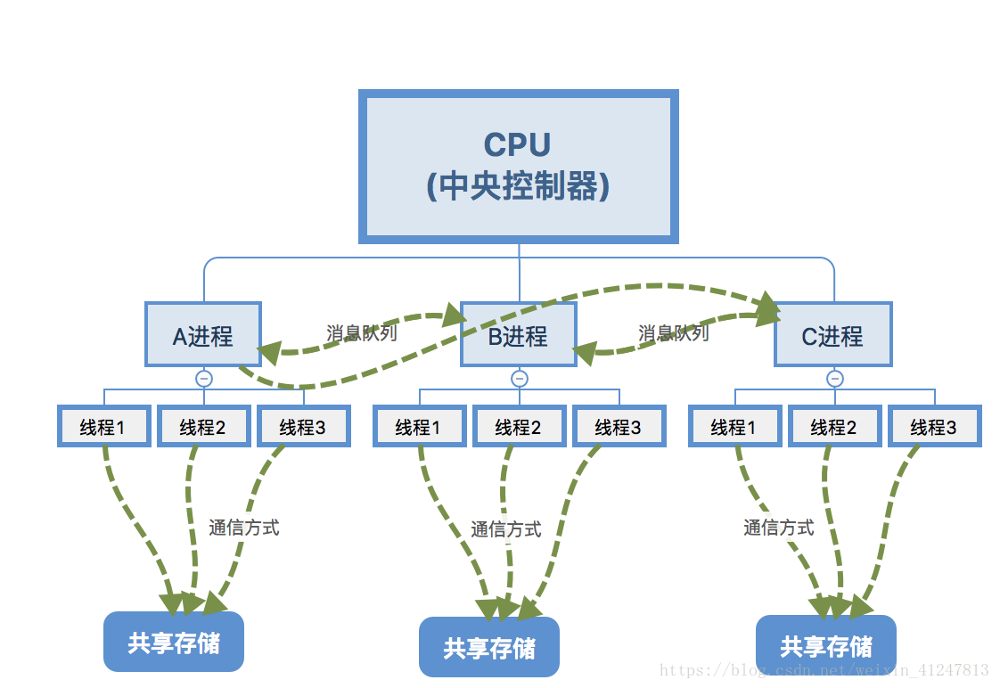
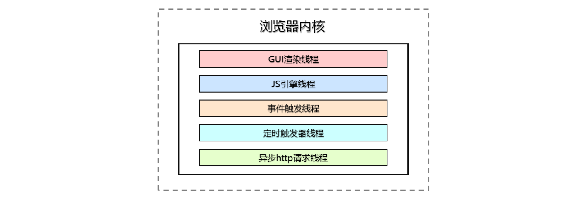
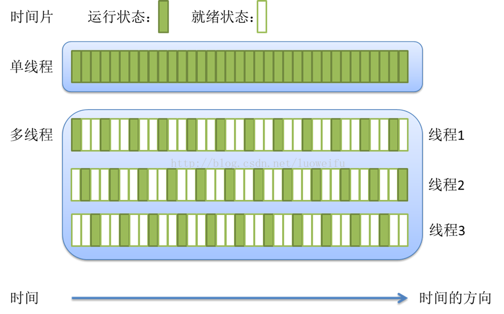
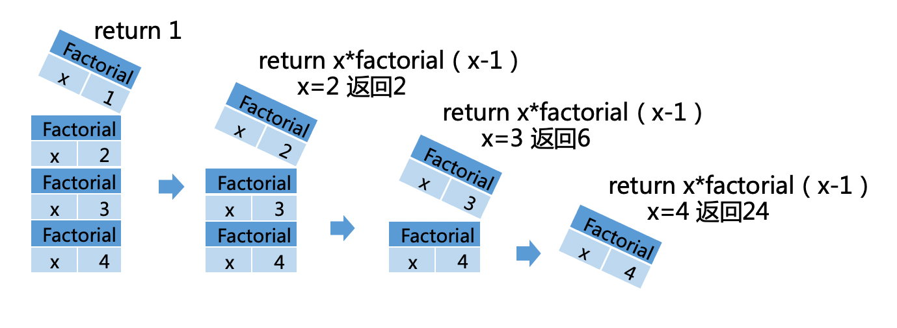
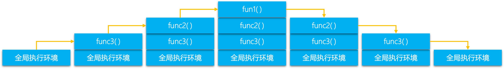
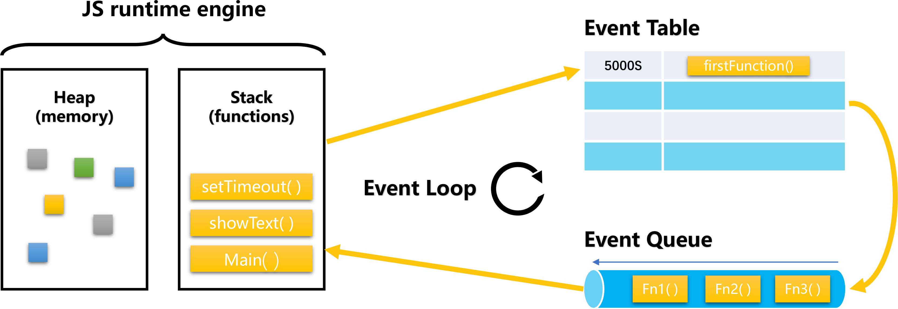
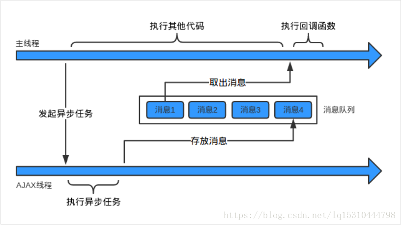

# JavaScript执行机制深度解析——调用栈、异步队列和事件循环(Event Loop)

## 大纲

1. 介绍线程和进程，JavaScript单线程语言的基础知识
2. 为什么JavaScript是单线程的，由JavaScript单线程引出同步执行栈、任务队列
3. 任务队列的详细讲解，如何管理同步异步执行，引出event loop模型
4. event loop模型构成的解析，运行过程讲解
5. browser端和node端event loop的分别讲解
6. 重点分析node的event loop模型和重点API
7. 一些典型例题的分析

## 关键词
* Call Stack：调用栈
* Event Table：异步事件表
* Event Queue：异步事件队列
* Event Loop：事件循环
* Callback Queue: 回调队列

## 线程和进程

  

1、进程（process）

狭义定义：进程就是一段程序的执行过程。
广义定义：进程是一个具有一定独立功能的程序关于某个数据集合的一次运行活动。它是操作系统动态执行的基本单元，在传统的操作系统中，进程既是基本的分配单元，也是基本的执行单元。

简单的来讲进程的概念主要有两点：第一，进程是一个实体。每一个进程都有它自己的地址空间，一般情况下，包括文本区域（text region）、数据区域（data region）和堆栈（stack region）。文本区域存储处理器执行的代码；数据区域存储变量和进程执行期间使用的动态分配的内存；堆栈区域存储着活动过程调用的指令和本地变量。第二，进程是一个“执行中的程序”。程序是一个没有生命的实体，只有处理器赋予程序生命时，它才能成为一个活动的实体，我们称其为进程。

进程状态：进程有三个状态，就绪、运行和阻塞。就绪状态其实就是获取了出cpu外的所有资源，只要处理器分配资源就可以马上执行。就绪状态有排队序列什么的，排队原则不再赘述。运行态就是获得了处理器分配的资源，程序开始执行。阻塞态，当程序条件不够时候，需要等待条件满足时候才能执行，如等待i/o操作时候，此刻的状态就叫阻塞态。

2、线程（thread）

通常在一个进程中可以包含若干个线程，当然一个进程中至少有一个线程，不然没有存在的意义。线程可以利用进程所拥有的资源，在引入线程的操作系统中，通常都是把进程作为分配资源的基本单位，而把线程作为独立运行和独立调度的基本单位，由于线程比进程更小，基本上不拥有系统资源，故对它的调度所付出的开销就会小得多，能更高效的提高系统多个程序间并发执行的程度。

3、多线程

在一个程序中，这些独立运行的程序片段叫作“线程”（Thread），利用它编程的概念就叫作“多线程处理”。多线程是为了同步完成多项任务，不是为了提高运行效率，而是为了提高资源使用效率来提高系统的效率。线程是在同一时间需要完成多项任务的时候实现的。

最简单的比喻多线程就像火车的每一节车厢，而进程则是火车。车厢离开火车是无法跑动的，同理火车也不可能只有一节车厢。多线程的出现就是为了提高效率。

二、说说区别

1、进程与线程的区别：

进程和线程的主要差别在于它们是不同的操作系统资源管理方式。进程有独立的地址空间，一个进程崩溃后，在保护模式下不会对其它进程产生影响，而线程只是一个进程中的不同执行路径。线程有自己的堆栈和局部变量，但线程之间没有单独的地址空间，一个线程死掉就等于整个进程死掉，所以多进程的程序要比多线程的程序健壮，但在进程切换时，耗费资源较大，效率要差一些。但对于一些要求同时进行并且又要共享某些变量的并发操作，只能用线程，不能用进程。

1. 简而言之,一个程序至少有一个进程,一个进程至少有一个线程.
2. 线程的划分尺度小于进程，使得多线程程序的并发性高。
3. 另外，进程在执行过程中拥有独立的内存单元，而多个线程共享内存，从而极大地提高了程序的运行效率。
4. 线程在执行过程中与进程还是有区别的。每个独立的线程有一个程序运行的入口、顺序执行序列和程序的出口。但是线程不能够独立执行，必须依存在应用程序中，由应用程序提供多个线程执行控制。
5. 从逻辑角度来看，多线程的意义在于一个应用程序中，有多个执行部分可以同时执行。但操作系统并没有将多个线程看做多个独立的应用，来实现进程的调度和管理以及资源分配。这就是进程和线程的重要区别。

  


### 关于JavaScript单线程这件事情

首先，JavaScript这一门单线程的语言（一段时间内只能做一件事）。那么为什么JavaScript设计之初是单线程语言。举个简单的例子，假定JavaScript同时有两个线程，一个线程在某个DOM节点上添加内容，另一个线程删除了这个节点，这时浏览器应该以哪个线程为准？ 所以，为了避免复杂性，从一诞生，JavaScript就是单线程，这已经成了这门语言的核心特征 。

  

单线程就意味着，所有任务需要排队，前一个任务结束，才会执行后一个任务。如果前一个任务耗时很长，后一个任务就不得不一直等着。

如果排队是因为计算量大，CPU忙不过来，倒也算了，但是很多时候CPU是闲着的，因为IO设备（输入输出设备）很慢（比如Ajax操作从网络读取数据），不得不等着结果出来，再往下执行。

为了解决等待异步任务执行结果过程中，资源闲置的问题，JavaScript语言的设计者意识到，这时主线程完全可以不管IO设备，挂起处于等待中的任务，先运行排在后面的任务。等到IO设备返回了结果，再回过头，把挂起的任务继续执行下去。

具体的做法就是让JS引擎执行JavaScript代码的主线程时分配一个stack，这就是**同步执行栈**，也叫做**调用栈（call stack）**，同时让JS引擎维护一个异步队列，用于维护异步事件，这就是**异步队列**（event queue）。


## 重中之重——执行栈

  
> factorial函数是一个理解调用栈难度适中的函数

关于执行栈，这其实并不是JavaScript专有的知识 ，计算机语言的执行几乎都是依赖于执行栈的。

> 执行栈是计算机科学中存储有关正在运行的子程序的消息的栈。经常被用于存放子程序的返回地址。在调用任何子程序时，主程序都必须暂存子程序运行完毕后应该返回到的地址。因此，如果被调用的子程序还要调用其他的子程序，其自身的返回地址就必须存入执行栈，在其自身运行完毕后再行取回。在递归程序中，每一层次递归都必须在执行栈上增加一条地址，因此如果程序出现无限递归（或仅仅是过多的递归层次），执行栈就会产生栈溢出。

关于执行栈的称呼或者说别名有很多种：
* 执行栈（Execution stack）
* 调用栈（Call stack）
* 控制栈（Control stack）
* 运行时栈（Run-time stack）
* 机器栈（Machine stack）

以上名词所要表达的都是一个意思，下文中指定使用 **执行栈** 表达

### **功能**

调用栈的主要功能是存放返回地址。除此之外，调用栈还用于存放：
* 本地变量：子程序的变量可以存入调用栈，这样可以达到不同子程序间变量分离开的作用。
* 参数传递：如果寄存器不足以容纳子程序的参数，可以在调用栈上存入参数。
* 环境传递：有些语言（如Pascal与Ada）支持“多层子程序”，即子程序中可以利用主程序的本地变量。这些变量可以通过调用栈传入子程序。

下面是段代码示例
```js
function func1() {
  console.log('in function1');
}

function func2() {
  func1();
  console.log('in function2');
}

function func3() {
  func2();
  console.log('in function3');
}

func3();
```




### 任务队列（消息队列，异步队列）

"异步队列"是一个先进先出的数据结构，排在前面的事件，优先被主线程读取。主线程的读取过程基本上是自动的，只要执行栈一清空，"异步队列"上第一位的事件就自动进入主线程。

如何处理异步任务的结果，这时候就需要"回调函数"（callback）。异步任务必须指定回调函数，当主线程开始执行异步任务，就是执行对应的回调函数。

JavaScript所有任务可以分成两种，一种是**同步任务（synchronous）**，另一种是**异步任务（asynchronous）**。
* 同步任务：同步任务会被推入到主线程分配的stack中，在stack中排队执行，只有前一个任务执行完毕，才能执行后一个任务；
* 异步任务：不进入主线程、而进入 **任务队列（task queue）** 的任务，只有"任务队列"通知主线程，某个异步任务可以执行了，该任务才会进入主线程执行。

在js中其实有两类**任务队列（task queue）**：**宏任务队列（macro tasks）**和**微任务队列（micro tasks）**。不同的异步任务会被安排在不同的异步任务队列中。

macrotask任务队列的来源有：
* setTimeout
* setInterval
* setImmediate
* I/O
* UI rendering

microtask任务队列的来源有：
* process.nextTick
* promises
* Object.observe
* MutationObserver


## Event Loop模型

上文中提到JavaScript是单线程，并且有同步任务和异步任务的区分，还有同步执行栈和异步任务队列的概念，那么如何组织这些元素使得JavaScript正常运行呢？这时候Event loop机制登场了。

Event Loop模型（图-2）


如果你暂时看不懂这个图，没有关系，让我们先学习铺垫知识。

### engine（引擎）和 runtime（运行时）

我们经常会听到engine（引擎）和runtime（运行时），它们的区别是什么呢？

* engine（引擎）：解释并编译代码，让它变成能交给机器运行的代码（runnable commands）。
* runtime（运行时）：就是运行环境，它提供一些对外接口供Js调用，以跟外界打交道，比如，浏览器环境、Node.js环境。不同的runtime，会提供不同的接口，比如，在 Node.js 环境中，我们可以通过 require 来引入模块；而在浏览器中，我们有 window、 DOM。

> JS引擎中负责解释和执行JavaScript代码的线程只有一个，就叫做主线程，实际上还有其它的线程，例如处理AJAX请求的线程、处理DOM事件的线程、定时器线程等等，他们叫做工作线程。


### Event Loop

Event loop在browser端和node端也有区分。浏览器的 Event Loop 遵循的是 HTML5 标准，而 NodeJs 的 Event Loop 遵循的是 libuv。

#### 浏览器的 Event Loop

我们上面讲到，当stack空的时候，就会从任务队列中，取任务来执行。浏览器这边，共分3步：

1. 取一个宏任务来执行。执行完毕后，下一步。
2. 取一个微任务来执行，执行完毕后，再取一个微任务来执行。直到微任务队列为空，执行下一步。
3. 更新UI渲染。

Event Loop 会无限循环执行上面3步，这就是Event Loop的主要控制逻辑。其中，第3步（更新UI渲染）会根据浏览器的逻辑，决定要不要马上执行更新。毕竟更新UI成本大，所以，一般都会比较长的时间间隔，执行一次更新。

从执行步骤来看，我们发现微任务，受到了特殊待遇！我们代码开始执行都是从script（全局任务）开始，所以，一旦我们的全局任务（属于宏任务）执行完，就马上执行完整个微任务队列。看个例子：


#### NodeJs 的 Event Loop


NodeJs 的运行是这样的：

1. 初始化 Event Loop
2. 执行您的主代码。这里同样，遇到异步处理，就会分配给对应的队列。直到主代码执行完毕。
3. 执行主代码中出现的所有微任务：先执行完所有nextTick()，然后在执行其它所有微任务。
4. 开始 Event Loop

NodeJs 的 Event Loop 分6个阶段执行：

```
   ┌───────────────────────────┐
┌─>│           timers          │
│  └─────────────┬─────────────┘
│  ┌─────────────┴─────────────┐
│  │     pending callbacks     │
│  └─────────────┬─────────────┘
│  ┌─────────────┴─────────────┐
│  │       idle, prepare       │
│  └─────────────┬─────────────┘      ┌───────────────┐
│  ┌─────────────┴─────────────┐      │   incoming:   │
│  │           poll            │<─────┤  connections, │
│  └─────────────┬─────────────┘      │   data, etc.  │
│  ┌─────────────┴─────────────┐      └───────────────┘
│  │           check           │
│  └─────────────┬─────────────┘
│  ┌─────────────┴─────────────┐
└──┤      close callbacks      │
   └───────────────────────────┘
```

```
   ┌───────────────────────┐
┌─>│        timers         │<————— 执行 setTimeout()、setInterval() 的回调
│  └──────────┬────────────┘
|             |<-- 执行所有 Next Tick Queue 以及 MicroTask Queue 的回调
│  ┌──────────┴────────────┐
│  │     pending callbacks │<————— 执行由上一个 Tick 延迟下来的 I/O 回调（待完善，可忽略）
│  └──────────┬────────────┘
|             |<-- 执行所有 Next Tick Queue 以及 MicroTask Queue 的回调
│  ┌──────────┴────────────┐
│  │     idle, prepare     │<————— 内部调用（可忽略）
│  └──────────┬────────────┘     
|             |<-- 执行所有 Next Tick Queue 以及 MicroTask Queue 的回调
|             |                   ┌───────────────┐
│  ┌──────────┴────────────┐      │   incoming:   │ - (执行几乎所有的回调，除了 close callbacks 以及 timers 调度的回调和 setImmediate() 调度的回调，在恰当的时机将会阻塞在此阶段)
│  │         poll          │<─────┤  connections, │ 
│  └──────────┬────────────┘      │   data, etc.  │ 
│             |                   |               | 
|             |                   └───────────────┘
|             |<-- 执行所有 Next Tick Queue 以及 MicroTask Queue 的回调
|  ┌──────────┴────────────┐      
│  │        check          │<————— setImmediate() 的回调将会在这个阶段执行
│  └──────────┬────────────┘
|             |<-- 执行所有 Next Tick Queue 以及 MicroTask Queue 的回调
│  ┌──────────┴────────────┐
└──┤    close callbacks    │<————— socket.on('close', ...)
   └───────────────────────┘
```

1. timers: 这个阶段执行setTimeout()和setInterval()设定的回调。
3. pending callbacks: 上一轮循环中有少数的 I/O callback 会被延迟到这一轮的这一阶段执行。
4. idle, prepare: 仅内部使用。
5. poll: 执行 I/O callback，在适当的条件下会阻塞在这个阶段
6. check: 执行setImmediate()设定的回调。
7. close callbacks: 执行比如socket.on('close', ...)的回调。

每个阶段执行完毕后，都会执行所有微任务（先 nextTick，后其它），然后再进入下一个阶段。

### Event loop 模型的优化
现在回过头在看（图-2），我们就能看懂JavaScript运行机制大概是怎么回事。

但其实，问题远没有这么简单：（图-2）中实际对于Event Loop的解释我是不满意的，因为并没有对于循环有着充分理解。



1. 创建call stack和heap， 初始化全局执行上下文，执行代码；
2. js引擎自上而下执行代码，主线程遇到Web APIs时，相应的工作线程接收请求并告知主线程已收到，返回异步函数并将回调函数放到Event Table中(这是一个注册过程)；
3. 主线程继续执行代码，工作线程完成工作后，Event Table会将这个函数移到Event Queue，Event Queue是个缓冲区域，这里的函数等着被调用并移到调用栈；
4. js引擎存在monitoring process进程，会持续不断的检查主线程执行栈是否为空，一旦为空,它会检查Event Queue里边是否有等待被调用的函数，检测到有排队的回调函数，会push到call stack，继续执行。


上图可以很好的说明同步执行栈和异步队列的关系，已经js引擎主线程与异步线程之间的关系。


**以上就是Event Loop执行的大致过程。**

来一个实例。。。

```js
setTimeout(function(){
  console.info('shaogucheng');
}, 0);
while (true) {
  let a;
}
```

```js
console.log(1);
setTimeout(function(){console.log(2);}, 0);
console.log(3);
```

```js
var button = document.querySelector('#btn');
button.addEventListener('click', function(e) {
  console.log('按钮');
});
```

```js
/* Within main.js */
var firstFunction = function () {  
  console.log("I'm first!");
};
var secondFunction = function () {  
  firstFunction();
  console.log("I'm second!");
};
secondFunction();
/* Results:
 * => I'm first!
 * => I'm second!
 */
```


参考资料
* [JavaScript 异步、栈、事件循环、任务队列][1]
* [javaScript异步、消息队列、事件循环][2]
* [JavaScript 事件循环（译文JavaScript Event Loop）][3]
* [JavaScript 运行机制详解：再谈Event Loop][4]
* [js运行机制详解（Event Loop）][5]
* [Event Loops, Event Tables & Event Queues in JavaScript][6]
* [Understanding JS: The Event Loop][7]
* [What is the JavaScript event loop?][8]
* [浏览器与NodeJS的EventLoop异同，以及部分机制。][9]
* [不要混淆nodejs和浏览器中的event loop][10]
* [从浏览器多进程到JS单线程，JS运行机制最全面的一次梳理][11]
* [深入理解Javascript之Callstack&EventLoop][12]
* [027 - 进阶函数-06 call stack 调用栈][13]
* [JavaScript中线程运行机制详解][14]

* [不要混淆nodejs和浏览器中的event loop][15]
* [一篇文章教会你Event loop——浏览器和Node][16]
* [nodejs中的event loop][17]
* [Node 定时器详解][18]

[1]: https://segmentfault.com/a/1190000011198232
[2]: https://blog.csdn.net/lq15310444798/article/details/80369086
[3]: https://segmentfault.com/a/1190000006811224
[4]: http://www.ruanyifeng.com/blog/2014/10/event-loop.html
[5]: https://www.jianshu.com/p/e06e86ef2595
[6]: https://knowledgescoops.com/javascript/event-loops-event-tables-event-queues-in-javascript/
[7]: https://hackernoon.com/understanding-js-the-event-loop-959beae3ac40
[8]: http://altitudelabs.com/blog/what-is-the-javascript-event-loop/
[9]: https://segmentfault.com/a/1190000015552098
[10]: https://cnodejs.org/topic/5a9108d78d6e16e56bb80882
[11]: https://www.cnblogs.com/cangqinglang/p/8963557.html
[12]: https://www.jianshu.com/p/735ee3d12a43
[13]: https://blog.csdn.net/weixin_34111819/article/details/87147031
[14]: https://segmentfault.com/a/1190000010345930
[15]: https://cnodejs.org/topic/5a9108d78d6e16e56bb80882
[16]: https://segmentfault.com/a/1190000013861128
[17]: https://www.jianshu.com/p/deedcbf68880
[18]: http://www.ruanyifeng.com/blog/2018/02/node-event-loop.html