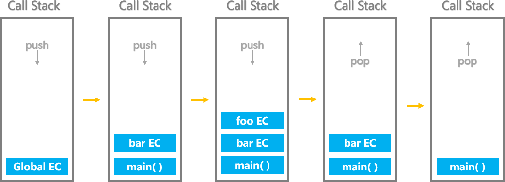
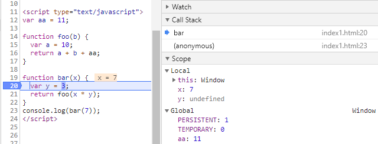
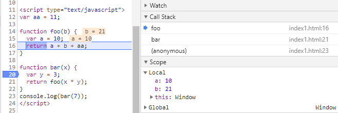

# JavaScript执行机制深度解析——调用栈和执行上下文


在 [JavaScript执行机制深度解析——调用栈、异步队列和事件循环(Event Loop)](https://github.com/Martin-Shao/Road-to-FullStack/blob/master/javascript/running-analysis/3.md) 一文中重点介绍了event loop模型。可以说event loop是处理异步事件的重要模型。但是在那篇文章中，我们是从宏观角度解析的event loop模型，重点介绍了任务队列以及相关知识。而这片文章我们就需要重点分析JS runtime engine中发生的事情。

## 大纲

* 代码执行的基础，内存分配
* 堆栈内存空间之间的区别
* 什么是调用栈？
* 什么是执行上下文，以及他和调用栈之间的关系


关于内存分配

首先 JS runtime engine 是真正解释执行JavaScript代码的地方。但正如我们日常生产的场景一样，在开办工厂从事生产之前，总需要有一块土地建设厂房和仓库。

> JavaScript 程序运行时，每个线程分配一个stack，每个进程分配一个heap，也就是说，stack是线程独占的，heap是线程共用的。此外，stack创建的时候，大小是确定的，数据超过这个大小，就发生stack overflow错误，而heap的大小是不确定的，需要的话可以不断增加。

开辟stack和heap内存空间的过程就像是建厂房和仓库的过程，但是要想真正的实现生产，还需要准备各种物料。准备物料的过程就像是在厂房中引进机器和生产原材料一样。同样，在生产真正开始之前，原材料是存储在仓库中的。


一方面调用栈存储了JavaScript的直接变量，另一方面，调用栈也是JavaScript直接执行的代码，这种概念就像是流水线和厂房的关系。

### 执行上下文

执行上下文就是当前 **JavaScript 代码被解析和执行时所在环境**的抽象概念，就跟干任何事情都需要一个场景一个道理，事务是无法凭空被完成的。

执行上下文总共有三种类型：

* **全局执行上下文**： 这是默认的、最基础的执行上下文。不在任何函数中的代码都位于全局执行上下文中。它做了两件事：1. 创建一个全局对象，在浏览器中这个全局对象就是 window 对象。2. 将 `this` 指针指向这个全局对象。一个程序中只能存在一个全局执行上下文。
* **函数执行上下文**： 每次调用函数时，都会为该函数创建一个新的执行上下文。每个函数都拥有自己的执行上下文，但是只有在函数被调用的时候才会被创建。一个程序中可以存在任意数量的函数执行上下文。每当一个新的执行上下文被创建，它都会按照特定的顺序执行一系列步骤，具体过程将在本文后面讨论。
* **Eval 函数执行上下文**： 运行在 `eval` 函数中的代码也获得了自己的执行上下文，但由于 Javascript 开发人员不常用 `eval` 函数，所以在这里不再讨论。

执行上下文的生命周期包括三个阶段：创建阶段→执行阶段→回收阶段。

当javascript解释器初始执行代码，它首先默认进入全局上下文。每次调用一个函数将会创建一个新的执行上下文。 


ECMAScript的程序执行都可以看做是一个执行上下文堆栈[execution context (EC) stack]。堆栈的顶部就是处于激活状态的上下文， 堆栈最底部即为全局执行上下文环境[global execution context]；

激活其它上下文的某个上下文被称为 调用者(caller) 。被激活的上下文被称为被调用者(callee) 。被调用者同时也可能是调用者(比如一个在全局上下文中被调用的函数调用某些自身的内部方法)。

当一个caller激活了一个callee，那么这个caller就会暂停它自身的执行，然后将控制权交给这个callee. 于是这个callee被放入堆栈，称为进行中的上下文[running/active execution context]. 当这个callee的上下文结束之后，会把控制权再次交给它的caller，然后caller会在刚才暂停的地方继续执行。在这个caller结束之后，会继续触发其他的上下文。一个callee可以用返回（return）或者抛出异常（exception）来结束自身的上下文。

下面是段代码示例
```html
<script type="text/javascript">
function foo(b) {
  var a = 5;
  return a + b + 10;
}

function bar(x) {
  var y = 3;
  return foo(x * y);
}
console.log(bar(6));
</script>
```

`JS runtime engine` 解释执行全局的代码时，首先创建全局的执行上下文，压入执行栈的顶部。每当进入一个函数的执行就会创建函数的执行上下文，并且把它压入执行栈的顶部。`JS runtime engine` 总是运行位于作用域链顶部的当前执行上下文，一旦当前函数执行完成后，当前函数的执行上下文出栈，并等待垃圾回收，并且将执行控制权还给之前的执行上下文。

用伪代码解释如下
``` js
// 全局上下文进栈
ECStack.push(globalContext)
// 函数bar上下文进栈
ECStack.push(barContext)
// 函数foo上下文进栈
ECStack.push(fooContext)
// 函数foo执行完毕
ECStack.pop()
// 函数bar执行完毕
ECStack.pop()
// 程序执行完毕
ECStack.pop()
```

静态图展示该过程


动画展示更加生动形象  


浏览器调试工具展示内部发生的机制



不同执行上下文之间的变量命名冲突通过攀爬作用域链解决，从局部直到全局。这意味着具有相同名称的局部变量在作用域链中有更高的优先级。简单的说，每次你试图访问函数执行上下文中的变量时，查找进程总是从自己的变量对象开始。如果在自己的变量对象中没发现要查找的变量，继续搜索作用域链。它将攀爬作用域链检查每一个执行上下文的变量对象，寻找和变量名称匹配的值。

下文预告：
我们大致了解了调用栈和执行上下文的关系，那么执行上下文内部到底发生了什么，跟this又有什么关系？

上下文
执行期上下文
作用域
作用域链


参考文章

* [深入理解JavaScript系列（11）：执行上下文（Execution Contexts）][1]
* [深入理解JavaScript执行上下文和执行栈][2]


[1]: https://www.cnblogs.com/zhangxiaolei521/p/5874712.html
[2]: http://www.zhiliaotang.net/jishujiaoliu/web/1020.html