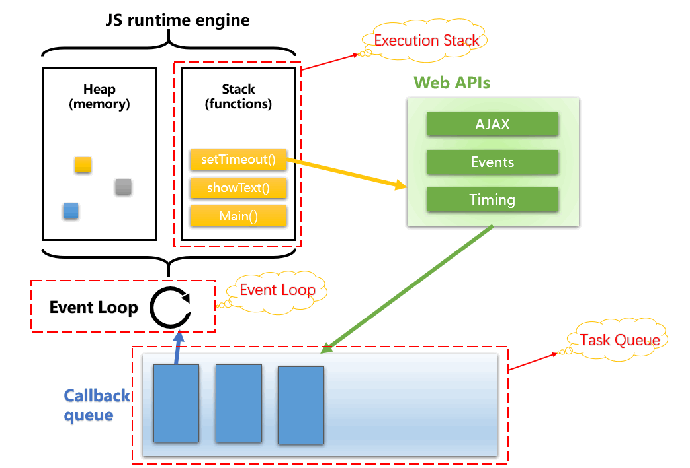
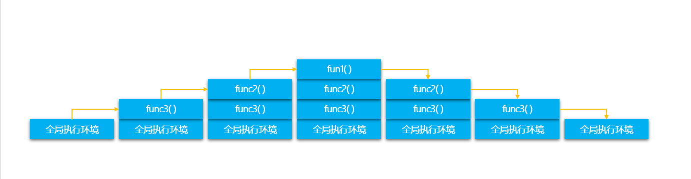

# JavaScript执行机制深度解析——执行栈、异步队列和事件循环


这是张比较经典的关于Event Loop运行原理图，我会对该图重要组成部分进行拆解讲解。

## 代码执行基础——执行栈

### 概念：

关于执行栈，这其实并不是JavaScript专有的知识 ，计算机语言的执行几乎都是依赖于执行栈的。

> 执行栈是计算机科学中存储有关正在运行的子程序的消息的栈。经常被用于存放子程序的返回地址。在调用任何子程序时，主程序都必须暂存子程序运行完毕后应该返回到的地址。因此，如果被调用的子程序还要调用其他的子程序，其自身的返回地址就必须存入执行栈，在其自身运行完毕后再行取回。在递归程序中，每一层次递归都必须在执行栈上增加一条地址，因此如果程序出现无限递归（或仅仅是过多的递归层次），执行栈就会产生栈溢出。

关于执行栈的称呼或者说别名有很多种：
* 执行栈（Execution stack）
* 调用栈（Call stack）
* 控制栈（Control stack）
* 运行时栈（Run-time stack）
* 机器栈（Machine stack）

以上名词所要表达的都是一个意思，下文中指定使用 **执行栈** 表达

### **功能**

调用栈的主要功能是存放返回地址。除此之外，调用栈还用于存放：
* 本地变量：子程序的变量可以存入调用栈，这样可以达到不同子程序间变量分离开的作用。
* 参数传递：如果寄存器不足以容纳子程序的参数，可以在调用栈上存入参数。
* 环境传递：有些语言（如Pascal与Ada）支持“多层子程序”，即子程序中可以利用主程序的本地变量。这些变量可以通过调用栈传入子程序。

下面是段代码示例
```js
function func1() {
  console.log('in function1');
}

function func2() {
  func1();
  console.log('in function2');
}

function func3() {
  func2();
  console.log('in function3');
}

func3();
```




  
> factorial函数是一个理解调用栈难度适中的函数


## 任务队列（消息队列，异步队列）

"异步队列"是一个先进先出的数据结构，排在前面的事件，优先被主线程读取。主线程的读取过程基本上是自动的，只要执行栈一清空，"异步队列"上第一位的事件就自动进入主线程。

如何处理异步任务的结果，这时候就需要"回调函数"（callback）。异步任务必须指定回调函数，当主线程开始执行异步任务，就是执行对应的回调函数。

JavaScript所有任务可以分成两种，一种是**同步任务（synchronous）**，另一种是**异步任务（asynchronous）**。
* 同步任务：同步任务会被推入到主线程分配的stack中，在stack中排队执行，只有前一个任务执行完毕，才能执行后一个任务；
* 异步任务：不进入主线程、而进入 **任务队列（task queue）** 的任务，只有"任务队列"通知主线程，某个异步任务可以执行了，该任务才会进入主线程执行。

在js中其实有两类**任务队列（task queue）**：**宏任务队列（macro tasks）**和**微任务队列（micro tasks）**。不同的异步任务会被安排在不同的异步任务队列中。浏览器和Node中的宏任务和微任务会有一点差异

**macrotask**任务队列的来源有：
# | 浏览器 | Node 
- | :-: | :-: 
I/O | ✅ | ✅
setTimeout | ✅| ✅
setInterval | ✅| ✅
setImmediate | ❌| ✅
UI rendering | ✅| ❌
requestAnimationFrame | ✅| ❌


**microtask**任务队列的来源有：
# | 浏览器 | Node 
- | :-: | :-: 
process.nextTick | ❌| ✅
MutationObserver | ✅| ❌
Promise.then catch finally | ✅| ✅


## Event Loop模型

上文中提到JavaScript是单线程，并且有同步任务和异步任务的区分，还有同步执行栈和异步任务队列的概念，这时候Event loop机制登场了。

### engine（引擎）和 runtime（运行时）

我们经常会听到engine（引擎）和runtime（运行时），它们的区别是什么呢？

* engine（引擎）：解释并编译代码，让它变成能交给机器运行的代码（runnable commands）。
* runtime（运行时）：就是运行环境，它提供一些对外接口供Js调用，以跟外界打交道，比如，浏览器环境、Node.js环境。不同的runtime，会提供不同的接口，比如，在 Node.js 环境中，我们可以通过 require 来引入模块；而在浏览器中，我们有 window、 DOM。

> 我们常说JavaScript是单线程的，但并不是JS引擎就只有一个线程。JS引擎中负责解释和执行JavaScript代码的线程只有一个，叫做主线程，实际上还有其它的线程，例如处理AJAX请求的线程、处理DOM事件的线程、定时器线程等等，他们叫做工作线程。


那么Event loop具体工作流程是什么样的？

文章开篇的时候是一张图关于Event loop的，这个是网上流传最广也是最经典的关于Event Loop运行模型图，但其实其中隐藏了一些运行时细节：这里我进行了一些优化。


对着这张图我们来分析具体的执行流程：
1、首先是JavaScript engine开辟Heap内存空间，创建Stack执行栈。（我们知道JavaScript有引用变量这回事，那么在具体执行过程中，引用变量其实就存储在Heap中）。

2、创建完执行栈后首先要创建全局环境，创建全局执行上下文（Global Execution Context），推入stack栈中。

3、当同步函数进入到运行环境，创建函数的执行环境，如果函数中调用了另外的函数，以此类推的将函数压入到执行栈。

4、此时栈顶没有压入函数时开始执行函数，顶部的函数执行完毕首先出栈。

5、执行栈中的函数调用到一些异步执行的API（例如异步Ajax，DOM事件，setTimeout等API），JS引擎会创建并维护一张 `Event Table` 的表，将异步的API存进表中，并且会开启对应的线程（Http异步请求线程，事件触发线程和定时器触发线程）进行监控和控制


6、当异步任务的事件满足触发条件时，对应的线程则会把该事件的处理函数推进 `Event Queue` (事件队列)中，等待主线程读取执行。（被推到事件队列中可以理解为异步API的回调函数。）

7、当JS引擎主线程上的任务执行完毕，则会读取任务队列中的事件，将任务队列中的事件任务推进主线程中，按任务队列顺序执行。

8、当JS引擎主线程上的任务执行完毕后，则会再次读取任务队列中的事件任务，如此循环，直到所有所有同步函数和回调函数执行完毕。这就是事件循环（Event Loop）的过程。

代码详解：

``` js
var firstFunction = function () {  
 console.log("I'm first!");
};

var secondFunction = function () {  
 setTimeout(firstFunction, 5000);
 console.log("I'm second!");
};

secondFunction();

/* Results:
 * => I'm second!
 * (And 5 seconds later)
 * => I'm first!
 */
```

下边模拟调用栈（在上个栗子的基础上我们这次推前点）

...

secondFunction调用setTimeout，setTimeout入栈：
1-s7d9UjolRGGjqFtfK0wZ8w.png

setTimeout执行后，浏览器会把setTimeout的回调函数(在这个栗子中是firstFunction)放到Event Table中。Event Table 就是个注册站：调用栈让Event Table注册一个函数，该函数会在5秒之后被调用。当指定的事情发生时，Event Table会将这个函数移到Event Queue。Event Queue其实就是个缓冲区域，这里的函数等着被调用并移到调用栈。
问题来了，什么时候函数会从Event Queue移到调用栈咧？JavaScript引擎依据一条规则：有一个monitoring process（不知翻译成啥好）会持续不断地检查调用栈是否为空，一旦为空，它会检查Event Queue里边是否有等待被调用的函数。如果存在，它就会调用这个Queue中第一个函数并将其移到调用栈中。如果Event Queue为空，那么这个monitoring process会继续不定期的检查。这一整个过程就是Event Loop。
1-XdKOatkDmsr-ft3nYs5wdQ.png

一旦回调函数加入到Event表中，代码不会被block住，浏览器不会等待5秒之后再继续处理接下去的代码，相反，浏览器继续执行secondFunction的下一行代码，console.log。
1-f2g4OgjfB7WXfWuOJUTY5Q.png

在background，Event Table会持续地监测是否有事件触发，将函数移到Event Queue中。在这个栗子中，secondFunction执行完毕，接着main.js也执行完毕。
1-wLH1GZRlFvc0ZDawOB1XAQ.png

从回调函数被放入Event Table后5秒钟，Event Table把firstFucntion移到Event Queue中。
1-0oy202Rt-94BDKOxKURVtw.png

由于事件循环持续地监测调用栈是否已空，此时它一注意到调用栈空了，就调用firstFunction并创建一个新的调用栈。
1-9Vpvh23CJNmxHVbkwrNpyQ.png

一旦firstFunction执行完毕，调用栈空了，Event Table里也没有注册函数，Event Queue也为空。
1-MmPtbaLvP54DuH-jHAjEXg.png

> 备注1：值得注意的是这里我并没有添加微任务和宏任务的内容，这部分内容将出现在下面章节。但是Event loop严格遵守的执行思路是：  
> 同步任务 -> 微任务 -> 宏任务

> 备注2：Event loop模型在浏览器端和Node端是有一定差距的，这一点会在后面的文章详细介绍。