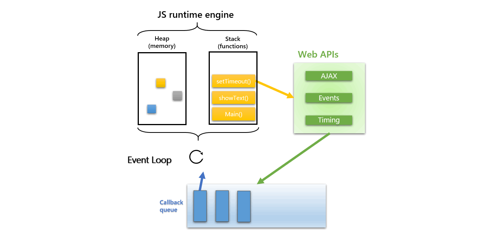

# JavaScript执行机制深度解析——调用栈和执行上下文



在 [JavaScript执行机制深度解析——调用栈、异步队列和事件循环(Event Loop)](https://github.com/Martin-Shao/Road-to-FullStack/blob/master/javascript/running-analysis/3.md) 一文中重点介绍了event loop模型。可以说event loop是处理异步事件的重要模型。但是在那篇文章中，我们是从宏观角度解析的event loop模型，重点介绍了任务队列以及相关知识。而这片文章我们就需要重点分析JS runtime engine中发生的事情。

如果你是JavaScript的设计者，你该如何实现一个JavaScript执行机制的模型？带着这样一个问题，我们开始JavaScript执行机制之旅。

还是为了回答上面的问题，我们写下一段JavaScript代码，扔进浏览器开始执行，如果让我们设计JavaScript的执行机制模型的话，我们需要做哪些工作？要怎么做？

大体的思路就是，至少要有存储变量的地方，然后要有函数执行执行的地方，在函数执行期间，要为函数准备各种物料。这里就引出了执行上下文和调用栈。

如何去理解执行上下文的概念？

先从字面上去理解，我们把这个概念拆分成 执行 和 上下文 两部分理解。首先什么是上下文？还记得初中语文课堂最常见的问题之一就是根据课文上下文理解这句话的意思，这样就容易理解，有的时候文章中单独的一句话是不能够很好理解的，要根据上下文去推敲要理解的句话的真实意义，套用在编程上也是同样的道理，一个函数可能会引用很多外部的变量或者函数，这时候单独的一个函数是无法依靠自已独立执行，它需要一个上下文，和所有相关的代码产生某种关联，从而顺利执行。剩下的执行二字就很好理解了，因为js的上下文只有在代码执行的时候才会创建。


## 大纲

* 代码执行的基础，内存分配
* 堆栈内存空间之间的区别
* 什么是调用栈？
* 什么是执行上下文，以及他和调用栈之间的关系


## 关于内存分配


首先 JS runtime engine 是真正解释执行JavaScript代码的地方。但正如我们日常生产的场景一样，在开办工厂从事生产之前，总需要有一块土地建设厂房和仓库。

> JavaScript 程序运行时，每个线程分配一个stack，每个进程分配一个heap，也就是说，stack是线程独占的，heap是线程共用的。此外，stack创建的时候，大小是确定的，数据超过这个大小，就发生stack overflow错误，而heap的大小是不确定的，需要的话可以不断增加。

开辟stack和heap内存空间的过程就像是建厂房和仓库的过程，但是要想真正的实现生产，还需要准备各种物料。准备物料的过程就像是在厂房中引进机器和生产原材料一样。同样，在生产真正开始之前，原材料是存储在仓库中的。

一方面调用栈存储了JavaScript的直接变量，另一方面，调用栈也是JavaScript直接执行的代码，这种概念就像是流水线和厂房的关系。

## JS执行中的堆栈结构

  
> factorial函数是一个理解调用栈难度适中的函数

``` js
function factorial (num) { 
  if (num < 0) { 
    return -1; 
  } else if (num === 0 || num === 1) { 
    return 1; 
  } else { 
    return (num * factorial(num - 1)); 
  } 
};
factorial(6);
```

关于执行栈，这其实并不是JavaScript专有的知识 ，计算机语言的执行几乎都是依赖于执行栈的。

> 执行栈是计算机科学中存储有关正在运行的子程序的消息的栈。经常被用于存放子程序的返回地址。在调用任何子程序时，主程序都必须暂存子程序运行完毕后应该返回到的地址。因此，如果被调用的子程序还要调用其他的子程序，其自身的返回地址就必须存入执行栈，在其自身运行完毕后再行取回。在递归程序中，每一层次递归都必须在执行栈上增加一条地址，因此如果程序出现无限递归（或仅仅是过多的递归层次），执行栈就会产生栈溢出。

关于执行栈的称呼或者说别名有很多种：
* 执行栈（Execution stack）
* 调用栈（Call stack）
* 控制栈（Control stack）
* 运行时栈（Run-time stack）
* 机器栈（Machine stack）

以上名词所要表达的都是一个意思，下文中指定使用 **执行栈** 表达

### **功能**

调用栈的主要功能是存放返回地址。除此之外，调用栈还用于存放：
* 本地变量：子程序的变量可以存入调用栈，这样可以达到不同子程序间变量分离开的作用。
* 参数传递：如果寄存器不足以容纳子程序的参数，可以在调用栈上存入参数。
* 环境传递：有些语言（如Pascal与Ada）支持“多层子程序”，即子程序中可以利用主程序的本地变量。这些变量可以通过调用栈传入子程序。

## 执行上下文

执行上下文就是当前 **JavaScript 代码被解析和执行时所在环境**的抽象概念，就跟干任何事情都需要一个场景一个道理，事务是无法凭空被完成的。

### 1.种类

ECMAScript代码由三种类型: 全局(global) 代码, 函数(function) 代码和 求值(eval) 代码，对应的执行上下文也有三种类型：

* **全局执行上下文**： 这是默认的、最基础的执行上下文。不在任何函数中的代码都位于全局执行上下文中。它做了两件事：1. 创建一个全局对象，在浏览器中这个全局对象就是 window 对象。2. 将 `this` 指针指向这个全局对象。一个程序中只能存在一个全局执行上下文。
* **函数执行上下文**： 每次调用函数时，都会为该函数创建一个新的执行上下文。每个函数都拥有自己的执行上下文，但是只有在函数被调用的时候才会被创建。一个程序中可以存在任意数量的函数执行上下文。每当一个新的执行上下文被创建，它都会按照特定的顺序执行一系列步骤，具体过程将在本文后面讨论。
* **Eval 函数执行上下文**： 运行在 `eval` 函数中的代码也获得了自己的执行上下文，但由于 Javascript 开发人员不常用 `eval` 函数，所以在这里不再讨论。

JavaScript的程序执行可以看做是一个执行上下文堆栈[execution context (EC) stack]（也就是我们常说的执行栈、调用栈）。当javascript解释器初始执行代码，会先默认创建一个全局上下文，进入全局上下文。代码在调用一个函数时将会创建一个新的函数执行上下文。

> 执行上下文是 JavaScript 代码执行的场景，那么执行栈就是执行上下文的容器

### 2.相同函数的不同状态执行上下文

函数调用都会产生具有不同状态的上下文，所以一个函数能可能产生无限数量的上下文集合。

```js
function foo(bar) {}
 
// call the same function,
// generate three different
// contexts in each call, with
// different context state (e.g. value
// of the "bar" argument)
 
foo(10);
foo(20);
foo(30);
```


### 3. 调用过程

上文我们说过，调用栈是一个具备栈数据结构的容器，创建执行上下文后是一个压栈的过程。程序开始运行，进入栈底的(栈的第一个元素) 全局执行上下文(global execution context) ，然后全局代码进行初始化，创建所需的对象与方法。在全局上下文的执行过程中，代码会激活其它(已经创建)函数并进入函数各自的执行上下文，一个执行上下文会激活其它上下文，比如一个函数调用另一个函数(或者在全局上下文中调用一个全局函数)，然后循环往复。

这就是执行上下文栈(execution context stack)建立起来的过程 。


> 堆栈的顶部就是处于激活状态的上下文， 堆栈最底部即为全局执行上下文环境[global execution context]。

激活其它上下文的某个上下文被称为 调用者(caller) 。被激活的上下文被称为被调用者(callee) 。被调用者同时也可能是调用者(比如一个在全局上下文中被调用的函数调用某些自身的内部方法)。

当一个caller激活了一个callee，那么这个caller就会暂停它自身的执行，然后将控制权交给这个callee. 于是这个callee被放入堆栈，称为进行中的上下文[running/active execution context]. 当这个callee的上下文结束之后，会把控制权再次交给它的caller，然后caller会在刚才暂停的地方继续执行。在这个caller结束之后，会继续触发其他的上下文。一个callee可以用返回（return）或者抛出异常（exception）来结束自身的上下文。

这里我们先不讨论异步的情况，这在《JavaScript执行机制深度解析——调用栈、异步队列和事件循环》一文中已经解释的很清楚，异步的WEB APIs总会指定回调函数，js引擎存在monitoring process进程，会持续不断的检查主线程执行栈是否为空，一旦为空，就会取出在任务队列中排队的回调函数执行。

下面是段代码示例
```html
<script type="text/javascript">
function foo(b) {
  var a = 5;
  return a + b + 10;
}

function bar(x) {
  var y = 3;
  return foo(x * y);
}
console.log(bar(6));
</script>
```

`JS runtime engine` 解释执行全局的代码时，首先创建全局的执行上下文，压入执行栈的顶部。每当进入一个函数的执行就会创建函数的执行上下文，并且把它压入执行栈的顶部。`JS runtime engine` 总是运行位于作用域链顶部的当前执行上下文，一旦当前函数执行完成后，当前函数的执行上下文出栈，并等待垃圾回收，并且将执行控制权还给之前的执行上下文。

用伪代码解释如下
``` js
// 全局上下文进栈
ECStack.push(globalContext)
// 函数bar上下文进栈
ECStack.push(barContext)
// 函数foo上下文进栈
ECStack.push(fooContext)
// 函数foo执行完毕
ECStack.pop()
// 函数bar执行完毕
ECStack.pop()
// 程序执行完毕
ECStack.pop()
```

静态图展示该过程


动画展示更加生动形象  


浏览器调试工具展示内部发生的机制


不同执行上下文之间的变量命名冲突通过攀爬作用域链解决，从局部直到全局。这意味着具有相同名称的局部变量在作用域链中有更高的优先级。简单的说，每次你试图访问函数执行上下文中的变量时，查找进程总是从自己的变量对象开始。如果在自己的变量对象中没发现要查找的变量，继续搜索作用域链。它将攀爬作用域链检查每一个执行上下文的变量对象，寻找和变量名称匹配的值。

### 4. 生命周期

执行上下文的生命周期包括三个阶段：创建阶段→执行阶段→回收阶段。

有一个函数上下文“EC1″和一个全局上下文“Global EC”，下图展现了从“Global EC”进入和退出“EC1″时栈的变化:

如图，调用栈的最底部是全局执行上下文，伴随着程序执行的始终，当有一个函数被调用时，相关执行上下文被创建压栈，执行完后被弹出，等待销毁。


下文预告：
我们大致了解了调用栈和执行上下文的关系，那么执行上下文内部到底发生了什么，跟this又有什么关系？

上下文
执行期上下文
作用域
作用域链


## 参考文章

* [深入理解JavaScript系列（11）：执行上下文（Execution Contexts）][1]
* [深入理解JavaScript执行上下文和执行栈][2]

[1]: https://www.cnblogs.com/zhangxiaolei521/p/5874712.html
[2]: http://www.zhiliaotang.net/jishujiaoliu/web/1020.html
