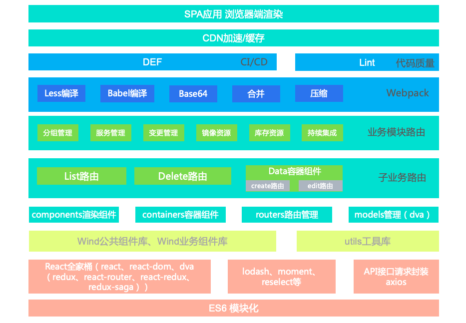

# 云视觉算法管控平台项目总结

## 关键词

* `VPC`: 全称 `Virtual Private Cloud` ，中文翻译“虚拟私有云”
* `SLB`: 全称 `Server Load Balance` ，中文翻译“服务负载均衡”
* `SLS`: 全称 `Simple Log Service` ，中文翻译“简单日志服务”
* `ONS`: 全称 `Open News Service` ，中文翻译“开放消息服务”
* `ACM`: 全称 `Application Configuration Manangement` ，中文翻译“应用配置管理”

## 大纲

* [ ] 业务理解和方法
* [x] 项目总体框架设计
* [ ] DEF平台的使用详解
* [ ] 基础框架出现问题和相关解释
* [ ] 路由设计和组件设计模式介绍
* [ ] React项目性能优化和相关实践
* [ ] 接口对接原则和请求工具封装实践
* [ ] 优秀插件、库的介绍和注意事项
* [ ] 代码规范和相关实践方法介绍
* [ ] 打包工具的优化和相关配置的实践
* [ ] 编程语言的选择和相关学习方法介绍
* [ ] 重构原则和重构工作的开展与实践

## 业务理解和方法

## 项目总体框架设计

### 架构分层介绍

## DEF平台的使用详解

### 相关文档介绍

> - DEF平台首页：https://def.alibaba-inc.com/
> - DEF发布文档：https://work.def.alibaba-inc.com/doc/index
> - DEF工程套件版本控制：https://def.alibaba-inc.com/my/next_module

待处理问题：
- [x] 持续集成停止部署时候，会报错：丢失regions的过程中请求getRegionInfo报错
- [ ] 后续的优化：将持续集成中部署信息显示的model以环境进行划分
- [x] 请求工具处理报错场景的异常，主要是错误信息和400，500请求等
- [ ] 所有表格信息展示中，文字过多的信息要做处理
- [x] 发布记录中实时持续集成的信息的查询、展示和跳转
- [ ] 首页我的服务的分页，调整分页大小的浮层没有展示
- [ ] 李凯要求的所有的表格页面增加关键字搜索的记忆
- [ ] 李凯要求的持续集成页面信息展示的句号删除
- [ ] 李凯要求分组管理、服务管理、变更记录做定向跳转
- [x] 发布记录的部署明细功能开发与测试
- [x] 首页一些细节的调整，发送请求工具的优化
- [ ] 服务的报表和日志有多个regoin的划分
- [x] 解决了持续集成中需要轮询展示信息的相关bug，其中比较典型的是切换环境的报错，以及redux缓存信息的处理
- [x] 首页 ‘我的持续集成’ 和 ‘我的服务’ 模块的开发，Card组件高度自适应问题的解决，分页问题有待自测，日常环境暂无测试条件
- [x] 我的发布记录模块的优化，分页问题的优化，发布失败记录的按钮置灰的处理

- [x] 分组的条件筛选文案和顺序，表格操作文案，分组名的表单规则校验
- [x] 服务的条件筛选文案和顺序，表格操作文案，分组名的表单规则校验
- [x] 非首页刷新页面顶部头像缺失
- [x] 变更列表的条件筛选文案和顺序，表格操作文案，分组名的表单规则校验
- [x] 持续集成部署状态信息的展示有问题，需要修改

注意问题：

1、对于后端返回的 null 值和空数组处理。
2、POD信息在切换环境时，会有请求粘滞问题
3、工作流日志详情信息会有请求粘滞问题
4、subscriptions优化全局单请求问题
5、dva问题，不会导致子组件的重新渲染
6、react+dva实现轮询方式，问题和解决方案
7、对于http请求工作的封装，异常请求的catch处理
8、react-router传递参数多种方式实现及原理解析
9、复杂页面如何设计路由，如何组织路由跳转，页面状态
10、如何更好的管理应用的model，协调effect
11、前端项目如何更好的使用eslint检查代码，通过eslint学习更好的代码书写方式
12、一些好的开发工具，插件，快捷键的使用，前端如何提升自己的开发效率
13、是否要具备产品思维，通过产品思维优化页面设计
14、前端数据结构的整理学习和小技巧，数组和对象转换，数组flat，对象flat等

15、对于React中表单处理，是一类重要且复杂的东西

16、项目框架总结

## 5、dva问题，不会导致子组件的重新渲染

dva+selector插件的组合，会导致一些基本类型的相同值覆盖，不重新渲染的问题。这里涉及到的问题比较复杂，这里做一个简单的梳理。
首先使用dva过程，用一个定时器重复dispatch一个基本类型的值，不会导致重新刷新。类似还有一个问题，父组件的props中，基本类型
的props变化时，没有导致子组件的重新渲染，这一异常现象。

## 14、JavaScript中一些数据结构的巧妙处理方式，运用函数式编程的思维，使用纯函数完成数据结构之间的相互转化，这里有一些例子：
	1、善用Array、Object的原生API，Array的map、filter、reduce、every、find等等都比较好用，Object的
	2、善用lodash等蕴含函数式编程的框架，pick、omit、等等还是非常好用的

## 16、项目的框架总结
	1⃣️目前框架依旧存在一些，一些废弃的生命周期的的告警，key值的告警等等，这些问题属于组件库的问题。
	2⃣️路由设计，框架中整体的路由设计依旧不是特别优雅，主要是没有做好动态路由，React-Router动态路由设计最佳实践
	3⃣️重复渲染，是解决重复请求问题，组件的重复渲染引起的重复请求，还有重复渲染引起的性能问题
	4⃣️请求工具，前端项目整体请求工具的设计，跟后端对接好的请求方式，确认请求数据的方式，确认发送服务端数据的方式，这方面的心得体会：
		1、基础框架的选择，一般都是axios，在此基础上进行二次封装，这就需要开发人员对于该axios的一些API和用法有一定了解，才能事半功倍
		2、对于异常的处理，一般分为两种，一种是4XX、5XX分为一种，一种是后端逻辑出现问题的报错，后端如果没有对错误进行特殊处理，例如
		      SQL异常、空指针异常、数组越界等等就会暴露给前端，这个要约定好处理方式，后端的错误返回码，错误在前端的抛出方式
		3、约定好返回码，一般复杂的业务场景需要和后端约定返回码，成功的场景和异常场景都会对应很多种情况
		4、约定好后端返回数据格式，尤其是约定好对于 null 值和 [] 空数组等的约定
	5⃣️一些插件、组件库、工具库等的选用和了解。npm包要注意安全性、兼容性、可靠性等，这里分为几个大类，框架基础肯定是渲染视图框架，主流
	     的是VUE、React各有优缺点，但是还是十分有必要深入掌握的。其次是状态管理，现在主流的视图层框架都会有相应的状态管理库。这次的项目
	    使用的是 DVA.js 这个框架是融合了 react-router、redux、react-redux、redux-saga 优点就是开箱即用，api简单，功能丰富。另外一些比较
	    特殊（骚操作）的用法，值得好好研究一下。
	6⃣️代码规范：这是一类大问题，代码规范虽然看似不起眼，但对于我而言，确是强迫症、一种追求。最简单粗暴的方式是直接配置好eslint，一遍
	    npm run lint 跑下来之后十分酸爽。但是lint检查不到命名规范，这也是在日常工作十分强调的。有个细节值得注意的是，前后端的命名规范最好
	    有一些共同的规范。
	7⃣️编程语言的选择，目前的前端，typescript 有着日渐普及的趋势，虽然一时间无法取代 JavaScript 的江湖地位，但是大型项目中使用 typescript 
	    编码实践，还是真香！
	8⃣️打工工具的选择和配置，就目前的前端届来说，webpack可谓是一骑绝尘，所以，学好webpack，走遍天下不用怕，学好webpack十分重要，最
	    感兴趣的配置还是
	9⃣️重构工作：重构方面可以分为好几个部分，由浅入深的做重构工作：

PPT高度概括 图文生动形象
项目介绍，整体上架构图，整体的思考，碰到一些技术难点的分享

## 请求工具的封装

### 需求和实现

- [x] 统一捕获接口报错
- [ ] 弹窗提示
- [ ] 报错重定向
- [ ] 基础鉴权
- [ ] 表单序列化