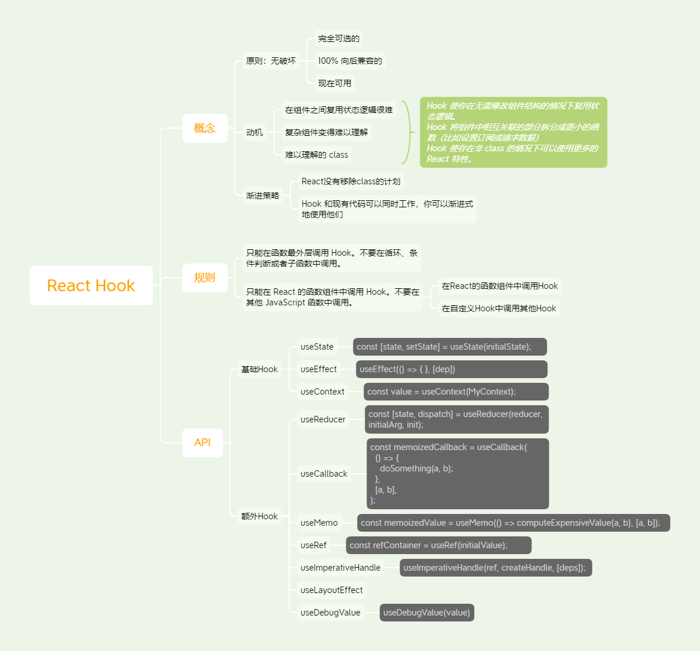

# React Hooks的到来

Hook 是 React 16.8 的新增特性。它可以让你在不编写 class 的情况下使用 state 以及其他的 React 特性。

* 完全可选的。 你无需重写任何已有代码就可以在一些组件中尝试 Hook。但是如果你不想，你不必现在就去学习或使用 Hook。
* 100% 向后兼容的。 Hook 不包含任何破坏性改动。
* 现在可用。 Hook 已发布于 v16.8.0。

原则

* 在组件之间复用状态逻辑很难 → Hook 使你在无需修改组件结构的情况下复用状态逻辑。 
* 复杂组件变得难以理解 → Hook 将组件中相互关联的部分拆分成更小的函数（比如设置订阅或请求数据）
* 难以理解的 class → Hook 使你在非 class 的情况下可以使用更多的 React 特性。

## 参考文章

* [Hook 简介](https://zh-hans.reactjs.org/docs/hooks-intro.html)
* [精读《React Hooks 最佳实践》](https://segmentfault.com/a/1190000020329053)
* [使用 React Hooks 重构你的小程序](https://aotu.io/notes/2019/07/10/taro-hooks/index.html)
* [整理了N个实用案例帮你快速迁移到React Hooks](https://bobi.ink/2019/08/10/react-hooks/)
* 