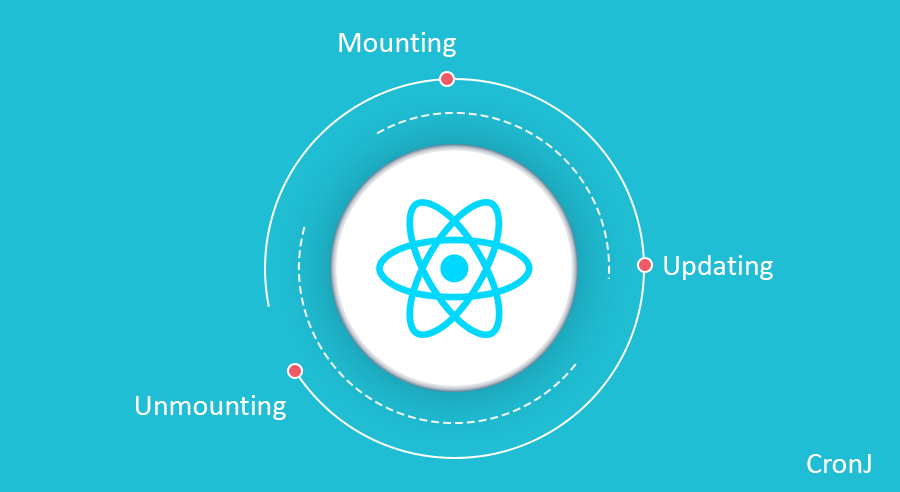
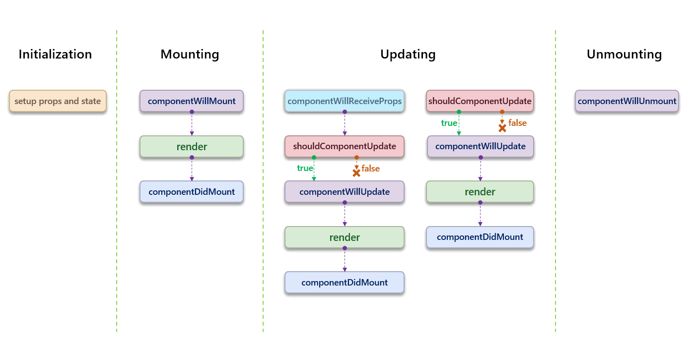
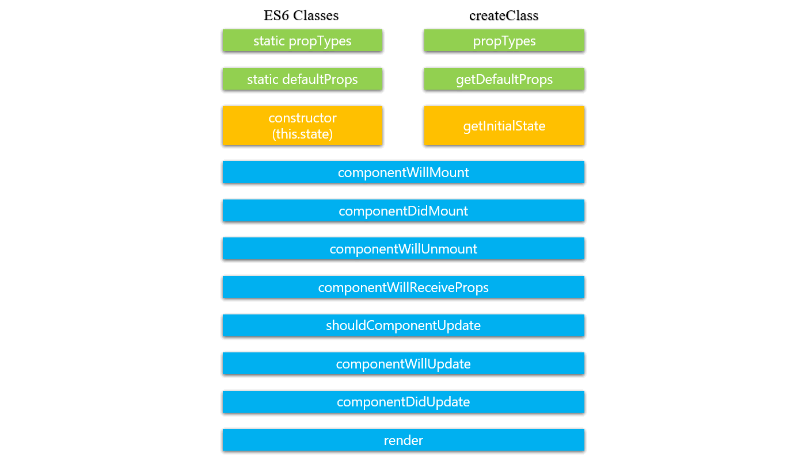
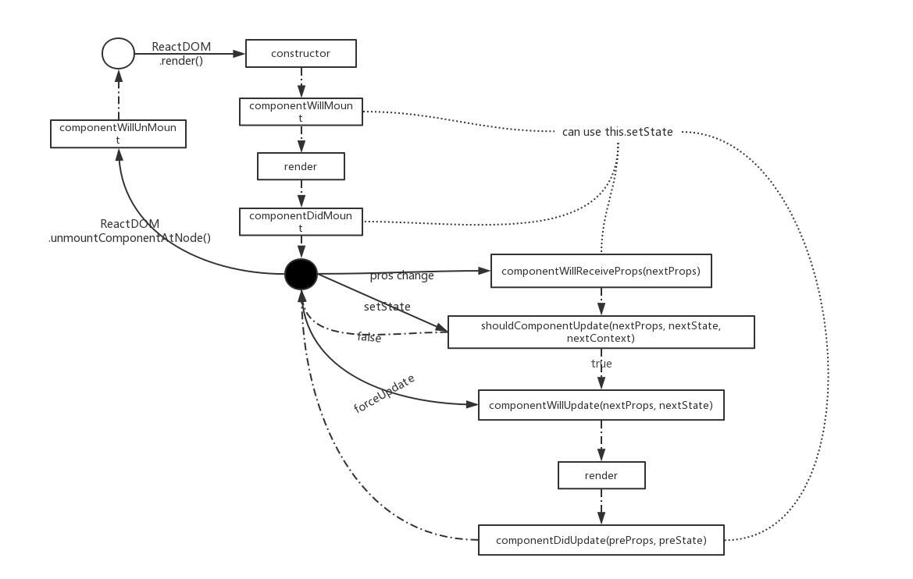
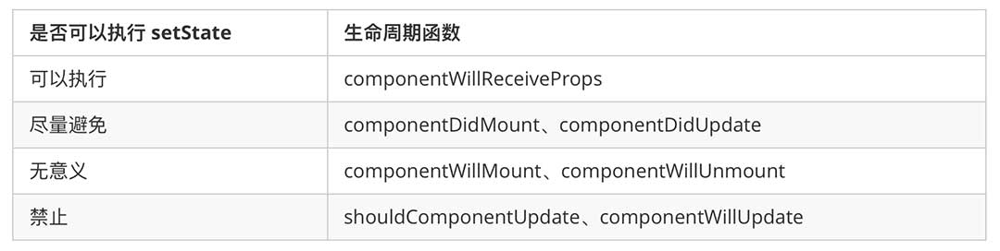
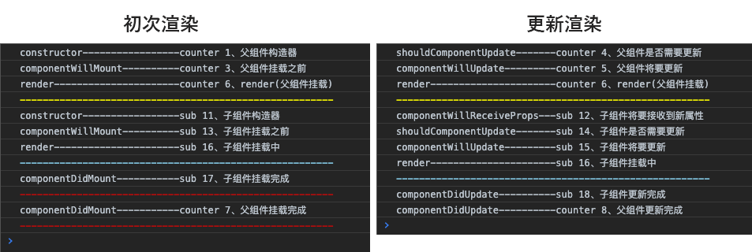
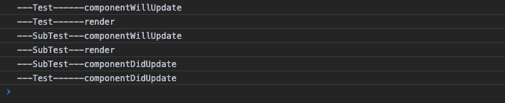
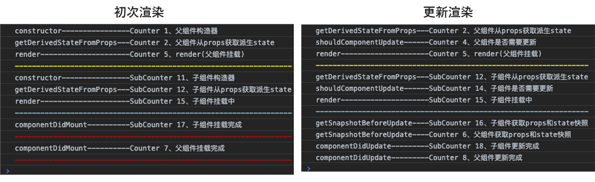

# React生命周期大总结(含新旧版本对比)



React近年版本升级变化

* **react 16.X** 引入了Fiber，全新的核心算法—— `reconciliation`
* **react 16.3** 引入了新生命周期 `getDerivedStateFromProps` 、 `getSnapshotBeforeUpdate` ，为不安全生命周期引入别名 `UNSAFE_componentWillMount`， `UNSAFE_componentWillReceiveProps` 和 `UNSAFE_componentWillUpdate` 。
* **react 16.4** 新生命周期 `getDerivedStateFromProps` 做了一些调整
* **react 16.9** 为 `componentWillMount` ， `componentWillReceiveProps` 和 `componentWillUpdate` 启用弃用警告。
* **react 17.X**（未来）删除 `componentWillMount` ， `componentWillReceiveProps` 和 `componentWillUpdate` 。

React 2013年推出至今（2019年）已经有6年时间，这期间 React 的生命周期发生了巨大的变化。一方面研究生命周期产生了那些变化，原因是什么？解决了什么问题？另外一方面也是对React生命周期更深入的理解，以及如何更好的使用。

首先，React 推出至今在我的认知里发生过一次大改动和一次小改动。**React 16** 版本由于使用了全新的核心算法架构 Fiber，由此对于新老生命周期做了一些改动。

## 16.8各生命周期讲解与注意事项

**React 16.8** 版本之前的生命周期如下：



另外还有一个有意思的图放在这里做一个比较。这里对比的是早先 `createClass` 新建组件的生命周期钩子函数和现在 `ES6 Classes` 方式新建组件的生命周期钩子函数的对比，可以看出虽然不尽相同，但是大多数还是保持一致，并且大多数生命周期的一直沿用至今，直到 **React 16.X** 版本的出现



16.8 版本之前的生命周期钩子函数研究一下，下面是生命周期对应的钩子函数：

* `constructor()`
* `componentWillMount()`
* `componentDidMount()`
* `componentWillUnmount()`
* `componentWillReceiveProps(nextProps)`
* `shouldComponentUpdate(nextProps, nextState)`
* `componentWillUpdate(nextProps, nextState)`
* `componentDidUpdate(prevProps, prevState)`
* `render()`

首先我们研究一下钩子函数具体执行顺序：



这张图详细的给出了钩子函数的执行顺序，另外一个细节就是 `setState` 方法能够执行的钩子函数也给明确的指出来了。以下来自于《深入React技术栈》总结

* 在 `componentWillMount` 中执行 `setState` 是无意义的，应该将这里的 `setState` 放到初始化 `this.state` 的地方去（如 `constructor`）直接作为 `state` 的初始值。原因是组件只挂载一次，在 `componentWillMount` 里 `setState` 会但是仅会更新 `state` 一次，而且会和 `constructor` 里的初始化 `state` 合并执行，因此这是无意义的 `setState`。
* 在 `componentDidMount` 中执行 `setState` 会导致组件在初始化的时候就触发了更新，渲染了两遍，应该尽量避免。有一些场景，比如在组件 `DOM` 渲染完成后获得DOM元素位置或者宽高等等设置为 `state`，会不得在 `componentDidMount` 之后 `setState`，但是除了这些必要的时候，都应该尽量避免在 `componentDidMount` 里 `setState。`
* 在 `componentWillUnmount` 中执行 `setState` 不会更新 `state`，是不生效而且无意义的。
* 禁止在 `shouldComponentUpdate` 和 `componentWillUpdate` 中调用 `setState`，这会造成循环调用，直至耗光浏览器内存后崩溃。了解了生命周期之后，这条很好理解。在 `shouldComponentUpdate` 或者 `componentWillUpdate` 里调用 `setState` 会再次触发这两个函数，然后在两个函数又触发了 `setState`，然后再次触发这两个函数。这样就进入了一个不停 `setState` 然后不停触发组件更新的死循环里，会导致浏览器内存耗光然后崩溃。
* 在 `componentDidUpdate` 中执行 `setState` 同样会导致组件刚刚完成更新又要再更新，进入死循环。但是在某些特殊情况下，比如说 `state` 或者 `props` 变化触发了 `DOM` 变化，需要重新获取 `DOM` 元素宽高时然后更新某个 `state` 的时候，就不得不在这个函数里使用 `setState` 了。此时一定要给 `setState` 设置一个前提条件`（ if (aaa) { setState(bbb) } ）`，以避免出现循环渲染的问题。 因此，如非必须，应该尽量避免在本函数里 `setState`。
* 在 `componentWillReceiveProps` 中可以 `setState`，不会造成二次渲染。由于只有 `props` 的变化才会触发 `componentWillReceiveProps` 事件，因为在这个事件里 `setState` 不会造成不停触发组件更新的死循环，可以放心在这个函数里 `setState`。

生命周期函数里 `setState` 的时机可以总结为以下表格：



为了更加生动的显示的钩子函数的执行顺序，给出了这样一个示例代码：

``` jsx
class SubCounter extends React.Component {

  constructor(props) {
    super(props);
    console.log('constructor-----------------sub', '11、子组件构造器');
    this.state = {
      number: this.props.number
    }
  }

  componentWillReceiveProps(nextProps) {
    this.setState({number: nextProps.number});
    console.info('sub', nextProps)
    console.log('componentWillReceiveProps---sub', '12、子组件将要接收到新属性');
  }

  componentWillMount() {
    console.log('componentWillMount----------sub', '13、子组件挂载之前');
  }

  componentDidMount() {
    console.log('componentDidMount-----------sub', '17、子组件挂载完成');
    console.log("%c-------------------------------------------------------", "color:red");
  }

  shouldComponentUpdate(nextProps, nextState) {
    console.log('shouldComponentUpdate-------sub', '14、子组件是否需要更新');
    if (nextProps.number < 5) return true;
    return false
  }

  componentWillUpdate(nextProps, nextState) {
    console.log('componentWillUpdate---------sub', '15、子组件将要更新');
  }

  componentDidUpdate(prevProps, prevState) {
    console.log('componentDidUpdate----------sub', '18、子组件更新完成');
  }

  componentWillUnmount() {
    console.log('componentWillUnmount---sub', '19、子组件将卸载');
  }

  render() {
    console.log('render----------------------sub', '16、子组件挂载中');
    console.log("%c-------------------------------------------------------", "color:skyblue");
    return (
      <p>{this.props.number} - {this.state.number}</p>
    )
  }
}

class Counter extends React.Component {
  static defaultProps = {
    //1、加载默认属性
    name: 'sls',
    age: 23
  };

  constructor(props) {
    super(props);
    //2、加载默认状态
    this.state = {
      number: 0,
    }
    console.log('constructor---sub', '1、父组件构造器');
    // this.test = this.test.bind(this);
  }

  componentWillMount() {
    const state1 = ['x'];
    const state2 = update(state1, {$push: ['y']}); // ['x', 'y']
    console.info(state2);
    console.log('componentWillMount----------counter', '3、父组件挂载之前');
  }

  componentDidMount() {
    console.log('componentDidMount-----------counter', '7、父组件挂载完成');
    console.log("%c-------------------------------------------------------", "color:red");
  }

  shouldComponentUpdate(nextProps, nextState) {
    console.log('shouldComponentUpdate-------counter', '4、父组件是否需要更新');
    if (nextState.number < 15) return true;
    return false
  }

  componentWillUpdate(nextProps, nextState) {
    console.log('componentWillUpdate---------counter', '5、父组件将要更新');
  }

  componentDidUpdate(prevProps, prevState) {
    console.log('componentDidUpdate----------counter', '8、父组件更新完成');
  }

  handleClick = () => {
    const { number } = this.state
    this.setState({
      number: number + 1,
    })
  };

  render() {
    console.log('render----------------------counter', '6、render(父组件挂载)');
    console.log("%c-------------------------------------------------------", "color:yellow");
    return (
      <div>
        <p>{this.state.number}</p>
        <button onClick={this.handleClick}>+</button>
        {this.state.number < 10 ? <SubCounter number={this.state.number} /> : null}
      </div>
    )
  }
}
```

对照的console打印出的日志，对于生命周期执行顺序有个更深刻的记忆。我认为这算是React最基础的知识点之一，请务必记住。



其实每个生命周期钩子都很重要，但这其中还是有主次关注的层序：constructor()、shouldComponentUpdate(nextProps, nextState)、componentWillReceiveProps(nextProps)、componentDidMount()

#### ✨`constructor`

构造器的问题涉及到四个比较值得讨论的问题：

1. 是否需要constructor与不用的影响;
2. constructor是否要调用super;
3. super中是否传入props与注意事项;
4. state初始化位置和注意事项;

*1. 是否需要constructor与不用的影响*: constructor 并不是React提出的，这是ES6对类的默认方法，通过 new 命令生成对象实例时自动调用该方法。并且，该方法是类中必须有的，如果没有显示定义，则会默认添加空的constructor()方法。所以有时候我们可以不用在类组件中调用一次constructor，这对于后面使用设置使用 state 和 props 完全没有任何影响。

``` jsx
import React from 'react'

class MyClass extends React.Component {
  state = {
    count: 0
  }
  render() {
    const { count } = this.state;
    return (
      <div>
        <span>{this.props.title}</span>
        <span>{count}</span>
        <button onClick={() => {this.setState({count: count+1})}}>增加1</button>
      </div>
    )
  }
}

ReactDOM.render(<MyClass title={"标题"} />, document.getElementById('root'));
```

*2. constructor是否要调用super*: 上面的例子我们知道，我们可以不用自己调用constructor，而是把这个工作交给组件。但是换句话说，如果你一旦调用了constructor 也就必须要调用super。关于这一点还是因为 ES6 的特性导致，在ES6中使用class实现继承，子类必须在constructor方法中调用super方法，否则新建实例时会报错(如果不调用 super 报错： `ReferenceError: this hasn't been initialised - super() hasn't been called`)。这是因为子类没有自己的this对象，而是继承父类的this对象，然后对其进行加工。如果不调用super方法，子类就得不到this对象。我们React组件一般都是继承 React.component ，存在这样的继承关系，就意味着在自调用constructor时必须声明super。

> 建立class时，当且仅当“使用了extends关键字并指定了constructor函数”，super关键字必须以super([arg1[, arg2...  argN]])的形式使用一次。此时super([arg1[, arg2...  argN]])相当于创建了一个对象，且以该对象为context调用extends关键字指示的函数（以new的形式），随后这个对象成为constructor函数的context。因此super([arg1[, arg2...  argN]])必须出现在constructor函数内的第一个this关键字之前，否则会报“this is not defined”的ReferenceError。亦可以super . IdentifierName的形式出现（这就与是否使用了extends关键字无关了）。super.IdentifierName作为getter使用时，表示函数B的prototype属性对象的[[prototype]]；super.IdentifierName作为setter使用时，super表示this。

``` js
class Super {
  constructor() {
    //do something
  }
}

class Sub extends Super {
  constructor() {
    super();
    //do something else
  }
}

//=========等价于=========

function Super() {
  //do something
}

function Sub() {
  Sub.prototype.__proto__ = Super.prototype; //extends
  Super.call(this); //constructor中的super
  //但是其实这个地方严格讲是有问题的
  //在使用ES6 class的时候，constructor并不负责创建成员函数
  //但是在用Constructor function时，一个function要管所有的
  //成员变量和函数的创建。
  //而Super里的所有东西都释放到当前上下文this中是不合适的
  //会出现命名冲突之类的
  //babel的具体的实现要比这个复杂很多。

  //do something else
}
```

*3. super中是否传入props与注意事项*: 在constructor中必须要调用super在上面我们已经说明，那么传入 props 又是什么情况？

``` jsx
class MyClass extends React.component{
  constructor(props){
    super();
    console.log(this.props); // this.props is undefined
  }
  render() {
    const { count } = this.state;
    return (
      <span>{this.props.title}</span> // 显示标题
    )
  }
}
```

上面代码就是答案，如果我们想在 constructor 中拿到 props 的话就必须转入 props。除此之外，在组件其他地方React会自动为你设置好props属性。

*4. state初始化位置和注意事项*: 一般认为初始化state状态的位置有两种：
1. 一种是作为类组件的属性声明在类里面；
2. 声明在构造函数里面，声明在这里面的好处是可以制造 派生状态(derived state)。

两种方式的效果差不多，差别在于第二种方式能够进行一些计算，利用props。

``` js
class MyClass extends React.Component {
  state = {
    loopsRemaining: this.props.maxLoops,
  }
}

class MyClass extends React.Component {
  constructor(props){
    super(props);
    this.state = {
      loopsRemaining: this.props.maxLoops,
    };
  }
}
```

#### ✨`componentWillMount()`

见名知意 `componentWillMount` 是组件即将渲染之前执行的生命周期钩子，这个钩子没有什么特别值得注意的，如果有的话就是以下几点：
1. 这个方法内调用 setState 不会发生重新渲染(re-render)；
2. 这个服务器端渲染唯一调用的钩子函数
3. 初次渲染组件时候执行，更新组件渲染不会执行

#### ✨`render()`

1 在componentWillMount()方法之后
2 在componentWillReceive(nextProps, nextState)方法之后

#### ✨`componentDidMount()`

见名知意 `componentDidMount` 钩子是在组件挂载之后执行（在render钩子执行之后理解执行），并且也是在初次渲染时候执行，更新组件渲染时不会执行。

#### ✨`componentWillReceiveProps(nextProps)`

getDerivedStateFromProps只为了一个目的存在。它使得一个组件能够响应props的变化来更新自己内部的state。比如我们之前提到的根据变化的offset属性记录目前的滚动方向或者根据source属性加载额外的数据。

在介绍这个生命周期之前，让我先引出一个概念：派生状态(derived state)
我们知道 `React` 最重要的数据流就是 `state` 和 `props` ，子组件接受父组件的数据即为 `props` ，那么有时候会有这样的操作，将接受的 `props` 转化为 `state` 。 `this.state.xxx = this.props.xxx` ，这也是一种反模式 `(anti-pattern)` ，我们常说React遵从单一数据流，当时如果有了派生状态，那意味这， `props` 的改变和 `setState` 都是改变指定的状态。

⚠️：有意思的是，React为了避免这种状况，在挂载时允许 `this.state.xxx = this.props.xxx` 这样的赋值情况，在之后的更新阶段， `props` 的变化再也不能引起 `state` 的改变。

反模式不是不能用，不论模式反模式，只要能够更好的实现业务就是好模式，那么如果解决派生状态无法更新的问题，componentWillReceiveProps()应运而生。这里也不得不说React框架设计的细节之处环环相扣。

componentWillReceiveProps() 会在已挂载的组件接收新的 props 之前被调用。如果你需要更新状态以响应 prop 更改（例如，重置它），可以比较 this.props 和 nextProps 并在此方法中使用 this.setState() 执行 state 转换。

1. 在已经挂在的组件(mounted component)接收到新props时触发;
2. 如果你需要在props发生变化(或者说新传入的props)来更新state，你可能需要比较this.props和nextProps, 然后使用this.setState()方法来改变this.state;
3. React可能会在porps传入时即使没有发生改变的时候也发生重新渲染, 所以如果你想自己处理改变，请确保比较props当前值和下一次值; 这可能造成组件重新渲染;
4. 如果你只是调用this.setState()而不是从外部传入props, 那么不会触发componentWillReceiveProps(nextProps)函数；这就意味着: this.setState()方法不会触发componentWillReceiveProps(), props的改变或者props没有改变才会触发这个方法;

注意:

使用此生命周期方法通常会出现 bug 和不一致性：

* 如果你需要执行副作用（例如，数据提取或动画）以响应 props 中的更改，请改用 componentDidUpdate 生命周期。
* 如果你使用 componentWillReceiveProps 仅在 prop 更改时重新计算某些数据，请使用 memoization helper 代替。
* 如果你使用 componentWillReceiveProps 是为了在 prop 更改时“重置”某些 state，请考虑使组件完全受控或使用 key 使组件完全不受控 代替。
* 对于其他使用场景，[请遵循此博客文章中有关派生状态的建议](https://zh-hans.reactjs.org/blog/2018/06/07/you-probably-dont-need-derived-state.html)。

#### ✨`shouldComponentUpdate(nextProps, nextState)`

这个生命周期钩子也是可以大作文章的一个，它与优化react渲染性能之间有着紧密的关系，既然如此，那就让我在这里小小讨论以下如何优化react性能。背靠着Virtual DOM的大靠山，如果想在考虑性能方便的问题，我们可以考虑从react渲染维度下手。与React渲染息息相关的就是生命周期。在如何使用生命周期优化性能之前，先让我们看一些关于React渲染有意思的细节：

1. 类组件中进行setState操作但是不改变state，会引起重新渲染！
2. 当父组件进行重新渲染操作时，即使子组件的props或state没有做出任何改变，也会同样进行重新渲染。

上面两个看起来让人有点伤感情的事情确是事实。

``` jsx
class SubTest extends React.Component {
  componentWillUpdate(nextProps, nextState) {
    console.info('---SubTest---componentWillUpdate')
  }
  componentDidUpdate(prevProps, prevState) {
    console.info('---SubTest---componentDidUpdate')
  }
  render() {
    console.info('---SubTest---render');
    return (
      <div>SubTest</div>
    )
  }
}

class Test extends React.Component {
  constructor(props) {
    super(props);
    this.state = {
      count: 1
    }
  }
  componentWillUpdate(nextProps, nextState) {
    console.info('---Test------componentWillUpdate')
  }
  componentDidUpdate(prevProps, prevState) {
    console.info('---Test------componentDidUpdate')
  }
  render() {
    console.info('---Test------render')
    return (
      <div>
        <SubTest />
        {this.state.count}
        <button onClick={() => this.setState({ count: 1 })}>Click Me</button>
      </div>
    )
  }
}
```


没有导致state的值发生变化的setState一样会导致重渲染。这回铁证如山，不容置疑了。这里就会造成很大的性能问题，但是React怎么可能会没有意识到这点，React把是否更新的权利交还给开发手里，开发通过某些生命周期人为控制是否重新渲染组件。(当然优化手段肯定不止这个，但这里主要说的是生命周期钩子)

这个生命周期就是 `shouldComponentUpdate()`

> shouldComponentUpdate() is invoked before rendering when new props or state are being received.

官方对于 `shouldComponentUpdate()` 给的解释是：当接收到新的 `props` 或 `state` 会在 `render` 函数之前被调用。更加详细的解释是： `shouldComponentUpdate(nextProps, nextState)` 钩子函数接受两个参数：`nextProps` 和 `nextState` ，分别表示下一个 `props` 和下一个 `state` 的值。并且，当函数返回 `false` 时候，会阻止接下来的 `render()` 函数的调用，阻止组件重渲染，而返回 `true` 时，组件照常重渲染。

这样我们就可以将变化前后的 props 和 state 进行比较， 用以决定是否对组件进行渲染。

上面这句话我们知道 `shouldComponentUpdate()`是在render之前执行的，在接收到新props或state时，或者说在，在接收新的props或state时确定是否发生重新渲染，默认情况返回true，表示会发生重新渲染。

注意
1. 这个方法在首次渲染时或者 `forceUpdate()` 时不会触发;
2. 在 `componentWillReceiveProps(nextProps)` 后触发;
2. 这个方法如果返回 `false` , 那么 `props` 或 `state` 发生改变的时候会阻止子组件发生重新渲染;
3. 目前，如果 `shouldComponentUpdate(nextProps, nextState)` 返回 `false` , 那么 `componentWillUpdate(nextProps, nextState)` , `render()`, `componentDidUpdate()` 都不会被触发;
4. Take care: 在未来，React可能把shouldComponentUpdate()当做一个小提示(hint)而不是一个指令(strict directive)，并且它返回false仍然可能触发组件重新渲染(re-render);

Good Idea  
在React 15.3以后, React.PureComponent已经支持使用，个人推荐，它代替了(或者说合并了)pure-render-mixin，实现了shallowCompare()。 扩展阅读

#### ✨`componentWillUpdate(nextProps, nextState)`

在props或state发生改变或者 `shouldComponentUpdate(nextProps, nextState)` 触发后, 在render()之前，注意以下的几点：
1. 这个方法在组件初始化时不会被调用;
2. 千万不要在这个函数中调用 `this.setState()` 方法;
3. 如果确实需要响应 `props` 的改变，那么你可以在 `componentWillReceiveProps(nextProps)` 中做响应操作;
4. 如果 `shouldComponentUpdate(nextProps, nextState)` 返回false，那么 `componentWillUpdate()` 不会被触发;

#### ✨`componentDidUpdate(prevProps, prevState)`

在发生更新或componentWillUpdate(nextProps, nextState)后，该钩子需要注意的以下几点：
1. 该方法不会再组件初始化时触发;
2. 使用这个方法可以对组件中的DOM进行操作;
3. 只要你比较了this.props和nextProps，你想要发出网络请求(nextwork requests)时就可以发出, 当然你也可以不发出网络请求;
4. 如果shouldComponentUpdate(nextProps, nextState)返回false, 那么componentDidUpdate(prevProps, prevState)不会被触发;

#### ✨`componentWillUnmount()`

在组件卸载(unmounted)或销毁(destroyed)之前。在卸载组件时候不能设置 State。这个方法可以让你处理一些必要的清理操作：

1. 断开网络请求
2. 清空计时器（setTimeout setInterval）
3. 删除在componentDidMount或其他地方添加的事件监听
4. 清理在componentDidMount中创建的 DOM 元素

## 169版本生命周期研究

当组件的 props 或 state 发生变化时会触发更新。组件更新的生命周期调用顺序如下：


挂载:

* `constructor()`
* `static getDerivedStateFromProps(props, state)`
* `render()`
* `componentDidMount()`

更新:

* `static getDerivedStateFromProps(props, state)`
* `shouldComponentUpdate(nextProps, nextState)`
* `render()`
* `getSnapshotBeforeUpdate(prevProps, prevState)`
* `componentDidUpdate(prevProps, prevState, snapshot)`

卸载:
* `componentWillUnmount()`

错误处理:
* `static getDerivedStateFromError(props, state)`
* `componentDidCatch()`

新增生命周期介绍

#### ✨getDerivedStateFromProps()

派生state实践原则

实现派生state有两种方式：
* getDerivedStateFromProps：从props派生出部分state，其返回值会被merge到当前state（成功上位）
* componentWillReceiveProps：在该生命周期函数里setState（惨遭废弃）

实际应用中，在两种常见场景中容易出问题（被称为anti-pattern，即反模式）：
* props变化时无条件更新state
* 更新state中缓存的props

getDerivedStateFromProps被认为是用来替代componentWillReceiveProps的，应对state需要关联props变化的场景：
> getDerivedStateFromProps exists for only one purpose. It enables a component to update its internal state as the result of changes in props.

即允许props变化引发state变化（称之为derived state，即派生state），虽然多数时候并不需要把props值往state里塞，但在一些场景下是不可避免的，比如：
* 记录当前滚动方向（recording the current scroll direction based on a changing offset prop）
* 取props发请求（loading external data specified by a source prop）

``` jsx
class SubCounter extends React.Component {

  constructor(props) {
    super(props);
    this.state = {
      number: this.props.number
    }
  }

  static getDerivedStateFromProps(nextProps, prevState) {
    // return prevState;
    return null
  }

  render() {
    return (
      <p>{this.props.number}-{this.state.number}</p>
    )
  }
}

class Counter extends React.Component {
  constructor(props) {
    super(props);
    this.state = {
      number: 0
    }
  }
  countUp = () => {
    const { number } = this.state;
    this.setState({ number: number + 1 });
  }

  countDown = () => {
    const { number } = this.state;
    this.setState({ number: number - 1 });
  }

  render() {
    return (
      <div className="container">
        <p>{this.state.number}</p>
        <button onClick={this.countUp}>+</button>
        <button onClick={this.countDown}>-</button>
        {this.state.number < 10 ? <SubCounter number={this.state.number} /> : null}
      </div>
    )
  }
}
```

* 注意⚠️ `getDerivedStateFromProps` 前面的关键字 `static` 意味这该钩子是一个静态方法，是通过class调用的，不是实例。
* `getDerivedStateFromProps` 会在调用 `render` 方法之前调用，并且在初始挂载及后续更新时都会被调用，想知道具体执行时期看上图。
* `getDerivedStateFromProps` 我以为该钩子主要为了解决派生状态的问题，接受两个参数，`nextProps, prevState`，它应返回一个对象来更新 `state` ，如果返回 `null` 则不更新任何内容。


#### ✨getSnapshotBeforeUpdate()

``` jsx
class ScrollingList extends React.Component {
  constructor(props) {
    super(props);
    this.listRef = React.createRef();
  }

  getSnapshotBeforeUpdate(prevProps, prevState) {
    // 我们是否在 list 中添加新的 items ？
    // 捕获滚动​​位置以便我们稍后调整滚动位置。
    if (prevProps.list.length < this.props.list.length) {
      const list = this.listRef.current;
      return list.scrollHeight - list.scrollTop;
    }
    return null;
  }

  componentDidUpdate(prevProps, prevState, snapshot) {
    // 如果我们 snapshot 有值，说明我们刚刚添加了新的 items，
    // 调整滚动位置使得这些新 items 不会将旧的 items 推出视图。
    //（这里的 snapshot 是 getSnapshotBeforeUpdate 的返回值）
    if (snapshot !== null) {
      const list = this.listRef.current;
      list.scrollTop = list.scrollHeight - snapshot;
    }
  }

  render() {
    return (
      <div ref={this.listRef}>{/* ...contents... */}</div>
    );
  }
}
```

getSnapshotBeforeUpdate() 在最近一次渲染输出（提交到 DOM 节点）之前调用。它使得组件能在发生更改之前从 DOM 中捕获一些信息（例如，滚动位置）。此生命周期的任何返回值将作为参数传递给 componentDidUpdate()。

此用法并不常见，但它可能出现在 UI 处理中，如需要以特殊方式处理滚动位置的聊天线程等。

应返回 snapshot 的值（或 null）。

在上述示例中，重点是从 getSnapshotBeforeUpdate 读取 scrollHeight 属性，因为 “render” 阶段生命周期（如 render）和 “commit” 阶段生命周期（如 getSnapshotBeforeUpdate 和 componentDidUpdate）之间可能存在延迟。

## 官方升级规划

逐步迁移路径

React遵循语义版本控制, 所以这种改变将是渐进的。我们目前的计划是：

16.3：为不安全生命周期引入别名UNSAFE_componentWillMount，UNSAFE_componentWillReceiveProps和UNSAFE_componentWillUpdate。 （旧的生命周期名称和新的别名都可以在此版本中使用。）
未来的16.9版本：为componentWillMount，componentWillReceiveProps和componentWillUpdate启用弃用警告。 （旧的生命周期名称和新的别名都可以在此版本中使用，但旧名称会记录DEV模式警告。）
17.0：删除componentWillMount，componentWillReceiveProps和componentWillUpdate。 （从现在开始，只有新的“UNSAFE_”生命周期名称将起作用。）
请注意，如果您是React应用程序开发人员，那么您不必对遗留方法进行任何操作。即将发布的16.3版本的主要目的是让开源项目维护人员在任何弃用警告之前更新其库。这些警告将在未来的16.x版本发布之前不会启用。

我们在Facebook上维护了超过50,000个React组件，我们不打算立即重写它们。我们知道迁移需要时间。我们将采用逐步迁移路径以及React社区中的所有人。

## 参考资料

* [正确掌握 React 生命周期 (Lifecycle)][1]
* [从componentWillReceiveProps说起][2]
* [浅析 React v16.3 新生命周期函数][3]
* [你可能不需要使用派生 state][4]

[1]: https://juejin.im/entry/587de1b32f301e0057a28897
[2]: http://www.ayqy.net/blog/%E4%BB%8Ecomponentwillreceiveprops%E8%AF%B4%E8%B5%B7/
[3]: https://github.com/fi3ework/blog/issues/37
[4]: https://zh-hans.reactjs.org/blog/2018/06/07/you-probably-dont-need-derived-state.html