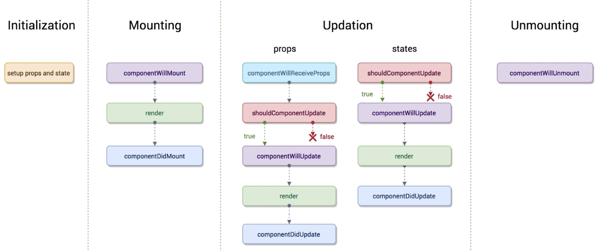
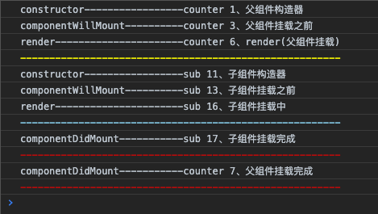
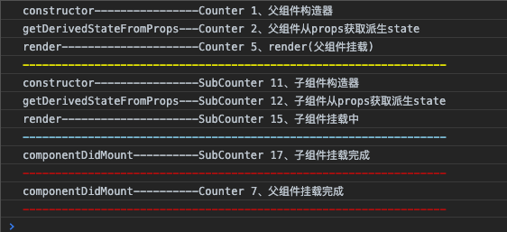
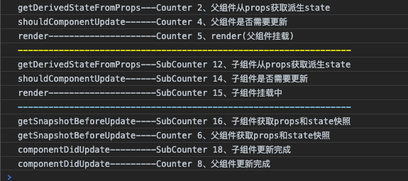

# React生命周期大总结(含新旧版本对比)

React近年版本升级变化

* **react 16.X** 引入了Fiber，全新的核心算法—— `reconciliation`
* **react 16.3** 引入了新生命周期 `getDerivedStateFromProps` 、 `getSnapshotBeforeUpdate` ，为不安全生命周期引入别名 `UNSAFE_componentWillMount`， `UNSAFE_componentWillReceiveProps` 和 `UNSAFE_componentWillUpdate` 。
* **react 16.4** 新生命周期 `getDerivedStateFromProps` 做了一些调整
* **react 16.9** 为 `componentWillMount` ， `componentWillReceiveProps` 和 `componentWillUpdate` 启用弃用警告。
* **react 17.X**（未来）删除 `componentWillMount` ， `componentWillReceiveProps` 和 `componentWillUpdate` 。

React 2013年推出至今（2019年）已经有6年时间，这期间 React 的生命周期发生了巨大的变化。一方面研究生命周期产生了那些变化，原因是什么？解决了什么问题？另外一方面也是对React生命周期更深入的理解，以及如何更好的使用。

首先，React推出至今在我的认知里发生过一次大改动和一次小改动。React 16 版本由于使用了全新的核心算法架构Fiber，由此对于新老生命周期做了一些改动。React 16 版本之前的生命周期如下：



另外还有一个有意思的图放在这里做一个比较。


下面是生命周期对应的钩子函数：

* constructor()
* componentWillMount()
* componentDidMount()
* componentWillUnmount()
* componentWillReceiveProps(nextProps)
* shouldComponentUpdate(nextProps, nextState)
* componentWillUpdate(nextProps, nextState)
* componentDidUpdate(prevProps, prevState)
* render()

首先我们研究一下钩子函数具体执行顺序：


这张图详细的给出了钩子函数的执行顺序，另外一个细节就是 setState 方法能够执行的钩子函数也给明确的指出来了。

为了更加生动的显示的钩子函数的执行顺序，给出了这样一个示例代码：

``` jsx

```




当组件的 props 或 state 发生变化时会触发更新。组件更新的生命周期调用顺序如下：


挂载:

constructor()
static getDerivedStateFromProps(props, state)
render()
componentDidMount()

更新:

static getDerivedStateFromProps(props, state)
shouldComponentUpdate(nextProps, nextState)
render()
getSnapshotBeforeUpdate(prevProps, prevState)
componentDidUpdate(prevProps, prevState, snapshot)

卸载:
componentWillUnmount()

错误处理:
static getDerivedStateFromError(props, state)
componentDidCatch()


## 官方升级规划

逐步迁移路径

React遵循语义版本控制, 所以这种改变将是渐进的。我们目前的计划是：

16.3：为不安全生命周期引入别名UNSAFE_componentWillMount，UNSAFE_componentWillReceiveProps和UNSAFE_componentWillUpdate。 （旧的生命周期名称和新的别名都可以在此版本中使用。）
未来的16.9版本：为componentWillMount，componentWillReceiveProps和componentWillUpdate启用弃用警告。 （旧的生命周期名称和新的别名都可以在此版本中使用，但旧名称会记录DEV模式警告。）
17.0：删除componentWillMount，componentWillReceiveProps和componentWillUpdate。 （从现在开始，只有新的“UNSAFE_”生命周期名称将起作用。）
请注意，如果您是React应用程序开发人员，那么您不必对遗留方法进行任何操作。即将发布的16.3版本的主要目的是让开源项目维护人员在任何弃用警告之前更新其库。这些警告将在未来的16.x版本发布之前不会启用。

我们在Facebook上维护了超过50,000个React组件，我们不打算立即重写它们。我们知道迁移需要时间。我们将采用逐步迁移路径以及React社区中的所有人。

## 派生状态（Derived State）和componentWillReceiveProps、getDerivedStateFromProps

* 什么是派生状态
* 什么时候使用派生状态
* 使用派生状态的常见bug

getDerivedStateFromProps只为了一个目的存在。它使得一个组件能够响应props的变化来更新自己内部的state。比如我们之前提到的根据变化的offset属性记录目前的滚动方向或者根据source属性加载额外的数据。