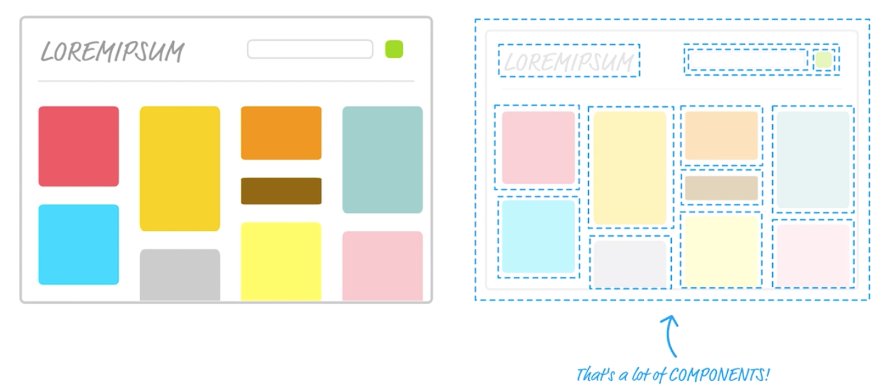
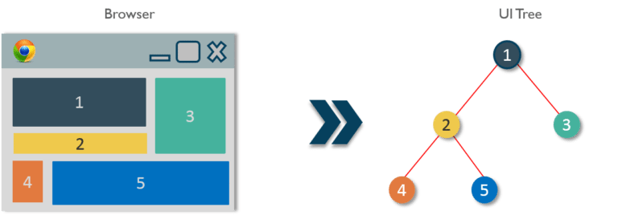
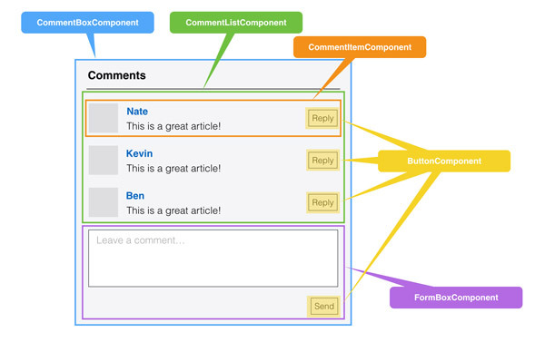

# React组件设计技巧——木偶组件和聪明组件




回到最初的话题： “组件化”。在我刚入行的时候，还不知道前端组件化是什么东西，那时候怎么写前端？html和css先写好，然后就是jQuery一把梭子“嘟嘟嘟”的打完收工。那画面也是美得不敢想象，一个js文件几千行代码，业务逻辑又长又臭，软件设计所谓的解耦复用连个鬼影都看不到，顶多把复杂的业务逻辑抽离以下，优化成单独的js文件。

然后就是前端组件化的时代带来了，从React到VUE，虽然还有什么虚拟dom、MVVM、diff算法等等花里胡哨的东西，但是组件化也是实打实为前端开发带来的春天，前端开发变得有章法可依，经典的软件设计理念也可以在前端开发中畅快淋漓的施展。

话题转回来，前端组件化到底给我们带来了什么？

百度百科：组件化是一种高效的处理复杂应用系统，更好的明确功能模块作用的方式。

通俗理解：在几年前端开发，应用系统中的功能模块之间是相互依赖、高度耦合。例如：修改A模块，就先找到跟A模块相关联的其他模块，注意修改A模块会对其他模块造成的影响；组件化不是一门新技术，它是一种思想。旨于构建纯粹的模块（称为组件化，进行组件化的模块为组件），模块单一功能原则，以此降低模块之间的耦合和依赖。

总结：组件化主要为了拆分复杂应用，降低模块之间的耦合度，明确组件之间的边界，有利于代码维护。提高组件复用（代码复用）；

1. 可组合（Composeable）：一个组件易于和其它组件一起使用，或者嵌套在另一个组件内部。如果一个组件内部创建了另一个组件，那么说父组件拥有（own）它创建的子组件，通过这个特性，一个复杂的UI可以拆分成多个简单的UI组件；
2. 可重用（Reusable）：每个组件都是具有独立功能的，它可以被使用在多个UI场景；
3. 可维护（Maintainable）：每个小的组件仅仅包含自身的逻辑，更容易被理解和维护；
4. 可测试（Testable）：因为每个组件都是独立的，那么对于各个组件分别测试显然要比对于整个UI进行测试容易的多。

但遗憾的是，真正好的框架也只有在真正努力好好使用它的开发手中，才能发挥出最大的价值。如何发挥出最大的价值，React框架已经把开发过程约束在组件化的体系之中，如何设计出更好的组件就是对于React最大使用价值的发挥。



（理想情况下，我们希望一个页面组成的组件是细粒度的，并且结构上也是形如DOM tree的UI tree）

虽然组件化时代已经到来，但是仍然阻止不了散发怪味道的代码，软件开发没有银弹，React、VUE也不可能是银弹。一个页面就是一个大组件的做法，在日常开发中还是屡见不鲜。为了写出更优秀的代码，我们不妨把那些体积庞大的组件合理拆分，然后思考以下这个拆分的过程。

再回到我们今天的话题：聪明组件和木偶组件。


为什么要把组件拆分成聪明组件和木偶组件？一个既定的事实是，前端的交互实质是对数据的操作，只不过这是一个可视化的过程，复杂的业务逻辑就避免不了使用 `redux` `react-redux`等工具对数据进行管理，也避免使用axios发送请求，更避免不了要处理复杂的数据结构，或是按照业务逻辑处理数据。一方面我们需要组件完成这些工作（比如说：聪明组件）。

另一方面，有些可能只需要展示或者完成一些简单的交互操作的部分，我们不妨抽离成单独的组件，使其具有更好的可测试性、可组合性、复用性（比如说：木偶组件）。对于Dumb组件，我们希望它只接受props，我们希望它能如纯函数那样，给定props，每次都能输出确定结果的view。dumb组件只关心一件事情：根据 props 进行渲染。

Dumb 组件最好不要依赖除了 React.js 和 Dumb 组件以外的内容。它们不要依赖 Redux 不要依赖 React-redux。这样的组件的可复用性是最好的，其他人可以安心地使用而不用怕会引入什么奇奇怪怪的东西。

到这里，我们把组件分成两大类，经过这样的分类，我们就更容易思考组件该怎么写。我把这两大类称作 Smart和 Dumb，但是我也听说他们被称为Fat 和 Skinny, Stateful 和 Pure, Screens 和 Components等。虽然叫法不同，但核心思想都差不多。

当我们拿到一个需求开始划分组件的时候，要认真考虑每个被划分成组件的单元到底会不会被复用。如果这个组件可能会在多处被使用到，那么我们就把它做成 Dumb 组件。

我们可能拆分了一堆 Dumb 组件出来。但是单纯靠 Dumb 是没有办法构建应用程序的，因为它们实在太“笨”了，对数据的力量一无所知。所以还有一种组件，它们非常聪明（smart），城府很深精通算计，我们叫它们 Smart 组件。它们专门做数据相关的应用逻辑，和各种数据打交道、和 Ajax 打交道，然后把数据通过 props 传递给 Dumb，它们带领着 Dumb 组件完成了复杂的应用程序逻辑。

Smart 组件不用考虑太多复用性问题，它们就是用来执行特定应用逻辑的。Smart 组件可能组合了 Smart 组件和 Dumb 组件；但是 Dumb 组件尽量不要依赖 Smart 组件。因为 Dumb 组件目的之一是为了复用，一旦它引用了 Smart 组件就相当于带入了一堆应用逻辑，导致它无法无用，所以尽量不要干这种事情。一旦一个可复用的 Dumb 组件之下引用了一个 Smart 组件，就相当于污染了这个 Dumb 组件树。如果一个组件是 Dumb 的，那么它的子组件们都应该是 Dumb 的才对。

**Dumb components:**

⚠️它必须能独立运作，不能依赖依赖这个app的actions 或者 stores 部分
* 可以允许有this.props.children,这样的话有助于这个组件有修改弹性
* 接受数据和数据的改变只能通过props來处理,不必也不能用state。
* 组件的外观能用一个css來维护(这样才更容易重用，类似支付宝的ant)
* 很少用到state,(一般呈现动画的时候可能会用到，比如控制下拉框的展开或者收起)
* 也许会用到其他的dumb components
* 比如说: Page, Sidebar, Story, UserInfo, List,像这些都是dumb components.

**smart components:**

* 一定包含至少一个Smart 或者 Dumb的元件，（木偶组件肯定是依附聪明组件生存的）
* 负责把从flux(or redux、Mobx等)接收到的state传给dumb component
* 负责call action,并把它的callback传給dumb component
* 它应该只有结构没有外观（改个样式只需要改dumb组件就好了，否则维护多个样式表很麻烦。）
* 比如说: UserPage, FollowersSidebar, StoryContainer,FollowedUserList.

这样做的好处
有助理你分离关注点，这样的话更有助于理解你的app的业务逻辑 和 它的ui

更有助于复用你的dumb组件，你可以将你的dumb组件复用于别的state下，而且这两个state还完全不同

本质上dumb 组件 其实 就是你的app的调色版。。你可以将它们放到一个页面上。。然后让设计师除了app的业务逻辑，样式随便怎么改，

划分 Smart 和 Dumb 组件

知道了组件有这两种分类以后，我们来重新审视一下之前的 make-react-redux 工程里面的组件，例如 src/Header.js：

``` jsx
import React, { Component } from 'react'
import PropTypes from 'prop-types'
import { connect } from 'react-redux'

class Header extends Component {
  static propTypes = {
    themeColor: PropTypes.string
  }

  render () {
    return (
      <h1 style={{ color: this.props.themeColor }}>React.js 小书</h1>
    )
  }
}

const mapStateToProps = (state) => {
  return {
    themeColor: state.themeColor
  }
}
Header = connect(mapStateToProps)(Header)

export default Header
```

这个组件到底是 Smart 还是 Dumb 组件？这个文件其实依赖了 react-redux，别人使用的时候其实会带上这个依赖，所以这个组件不能叫 Dumb 组件。但是你观察一下，这个组件在 connect 之前它却是 Dumb 的，就是因为 connect 了导致它和 context 扯上了关系，导致它变 Smart 了，也使得这个组件没有了很好的复用性。

为了解决这个问题，我们把 Smart 和 Dumb 组件分开到两个不同的目录，不再在 Dumb 组件内部进行 connect，在 src/ 目录下新建两个文件夹 components/ 和 containers/：

```
src/
  components/
  containers/
```

我们规定：所有的 Dumb 组件都放在 components/ 目录下，所有的 Smart 的组件都放在 containers/ 目录下，这是一种约定俗成的规则。

删除 src/Header.js，新增 src/components/Header.js：

``` jsx
import React, { Component } from 'react'
import PropTypes from 'prop-types'

export default class Header extends Component {
  static propTypes = {
    themeColor: PropTypes.string
  }

  render () {
    return (
      <h1 style={{ color: this.props.themeColor }}>React.js 小书</h1>
    )
  }
}
```

现在 src/components/Header.js 毫无疑问是一个 Dumb 组件，它除了依赖 React.js 什么都不依赖。我们新建 src/container/Header.js，这是一个与之对应的 Smart 组件：

```jsx
import { connect } from 'react-redux'
import Header from '../components/Header'

const mapStateToProps = (state) => {
  return {
    themeColor: state.themeColor
  }
}
export default connect(mapStateToProps)(Header)
```

它会从导入 Dumb 的 Header.js 组件，进行 connect 一番变成 Smart 组件，然后把它导出模块。

这样我们就把 Dumb 组件抽离出来了，现在 src/components/Header.js 可复用性非常强，别的同事可以随意用它。而 src/containers/Header.js 则是跟业务相关的，我们只用在特定的应用场景下。我们可以继续用这种方式来重构其他组件。

组件划分原则
接下来的情况就有点意思了，可以趁机给大家讲解一下组件划分的一些原则。我们看看这个应用原来的组件树：

对于 Content 这个组件，可以看到它是依赖 ThemeSwitch 组件的，这就需要好好思考一下了。我们分两种情况来讨论：Content 不复用和可复用。

Content 不复用
如果产品场景并没有要求说 Content 需要复用，它只是在特定业务需要而已。那么没有必要把 Content 做成 Dumb 组件了，就让它成为一个 Smart 组件。因为 Smart 组件是可以使用 Smart 组件的，所以 Content 可以使用 Dumb 的 ThemeSwitch 组件 connect 的结果。

新建一个 src/components/ThemeSwitch.js：

``` jsx
import React, { Component } from 'react'
import PropTypes from 'prop-types'

export default class ThemeSwitch extends Component {
  static propTypes = {
    themeColor: PropTypes.string,
    onSwitchColor: PropTypes.func
  }

  handleSwitchColor (color) {
    if (this.props.onSwitchColor) {
      this.props.onSwitchColor(color)
    }
  }

  render () {
    return (
      <div>
        <button
          style={{ color: this.props.themeColor }}
          onClick={this.handleSwitchColor.bind(this, 'red')}>Red</button>
        <button
          style={{ color: this.props.themeColor }}
          onClick={this.handleSwitchColor.bind(this, 'blue')}>Blue</button>
      </div>
    )
  }
}
```

这是一个 Dumb 的 ThemeSwitch。新建一个 src/containers/ThemeSwitch.js：

``` jsx
import { connect } from 'react-redux'
import ThemeSwitch from '../components/ThemeSwitch'

const mapStateToProps = (state) => {
  return {
    themeColor: state.themeColor
  }
}
const mapDispatchToProps = (dispatch) => {
  return {
    onSwitchColor: (color) => {
      dispatch({ type: 'CHANGE_COLOR', themeColor: color })
    }
  }
}
export default connect(mapStateToProps, mapDispatchToProps)(ThemeSwitch)
```

这是一个 Smart 的 ThemeSwitch。然后用一个 Smart 的 Content 去使用它，新建 src/containers/Content.js：

``` jsx
import React, { Component } from 'react'
import PropTypes from 'prop-types'
import ThemeSwitch from './ThemeSwitch'
import { connect } from 'react-redux'

class Content extends Component {
  static propTypes = {
    themeColor: PropTypes.string
  }

  render () {
    return (
      <div>
        <p style={{ color: this.props.themeColor }}>React.js 小书内容</p>
        <ThemeSwitch />
      </div>
    )
  }
}

const mapStateToProps = (state) => {
  return {
    themeColor: state.themeColor
  }
}
export default connect(mapStateToProps)(Content)
```

删除 src/ThemeSwitch.js 和 src/Content.js，在 src/index.js 中直接使用 Smart 组件：

```
...
import Header from './containers/Header'
import Content from './containers/Content'
...
```

这样就把这种业务场景下的 Smart 和 Dumb 组件分离开来了：

```
src
├── components
│   ├── Header.js
│   └── ThemeSwitch.js
├── containers
│   ├── Content.js
│   ├── Header.js
│   └── ThemeSwitch.js
└── index.js
```

Content 可复用
如果产品场景要求 Content 可能会被复用，那么 Content 就要是 Dumb 的。那么 Content 的之下的子组件 ThemeSwitch 就一定要是 Dumb，否则 Content 就没法复用了。这就意味着 ThemeSwitch 不能 connect，即使你 connect 了，Content 也不能使用你 connect 的结果，因为 connect 的结果是个 Smart 组件。

这时候 ThemeSwitch 的数据、onSwitchColor 函数只能通过它的父组件传进来，而不是通过 connect 获得。所以只能让 Content 组件去 connect，然后让它把数据、函数传给 ThemeSwitch。

这种场景下的改造留给大家做练习，最后的结果应该是：

```
src
├── components
│   ├── Header.js
│   ├── Content.js
│   └── ThemeSwitch.js
├── containers
│   ├── Header.js
│   └── Content.js
└── index.js
```

可以看到对复用性的需求不同，会导致我们划分组件的方式不同。

总结
根据是否需要高度的复用性，把组件划分为 Dumb 和 Smart 组件，约定俗成地把它们分别放到 components 和 containers 目录下。

Dumb 基本只做一件事情 —— 根据 props 进行渲染。而 Smart 则是负责应用的逻辑、数据，把所有相关的 Dumb（Smart）组件组合起来，通过 props 控制它们。

Smart 组件可以使用 Smart、Dumb 组件；而 Dumb 组件最好只使用 Dumb 组件，否则它的复用性就会丧失。

要根据应用场景不同划分组件，如果一个组件并不需要太强的复用性，直接让它成为 Smart 即可；否则就让它成为 Dumb 组件。

还有一点要注意，Smart 组件并不意味着完全不能复用，Smart 组件的复用性是依赖场景的，在特定的应用场景下是当然是可以复用 Smart 的。而 Dumb 则是可以跨应用场景复用，Smart 和 Dumb 都可以复用，只是程度、场景不一样。



## 参考资料

* [Smart 组件 vs Dumb 组件][1]
* [组件化开发中的智能组件与木偶组件][2]
* [React（四）：Smart组件与Dumb组件][3]
* [［译］Smart and Dumb Components][4]
* [React Components – Props and States in ReactJS with Examples][5]

[1]: http://huziketang.mangojuice.top/books/react/lesson43
[2]: https://juejin.im/entry/579ec0efc4c971005ade40ad
[3]: https://blog.csdn.net/u012131835/article/details/83823977
[4]: https://segmentfault.com/a/1190000004111786
[5]: https://www.edureka.co/blog/react-components/
