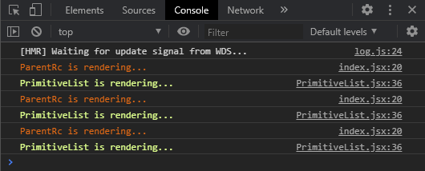
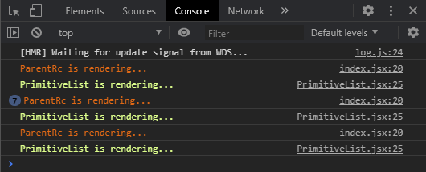
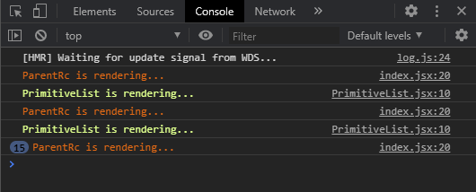

# React组件性能优化—— Memo组件

之前的文章，我们已经提到过如何使用 PureComponent 优化组件渲染性能，但是聪明的同学很快就会发现，PureComponent 是针对类组件的，React有两大类型组件：class组件和function组件，对于function组件并没有 shouldComponentUpdate 这样的生命周期方法，难道我们就没办法对 function组件进行渲染性能优化嘛？

答案肯定是否定的，下面我们将利用代码，把PureComponent 和 memo 作为比较来理解memo

``` js
ParentRc extends Component {

  state = {
    count: 10,
    dark: false
  }

  handleCountChange = () => this.setState({ count: this.state.count + 1 })

  render() {
    const { count, dark } = this.state
    const theme = {
      backgroundColor: dark ? '#333' : '#FFF',
      color: dark ? '#FFF' : '#333'
    }
    console.info('%cParentRc is rendering...', 'color: #e96a25')
    return (
      <div style={theme}>
        <button onClick={() => this.setState(({ dark: preDark }) => ({ dark: !preDark }))}>Toggle theme</button>
        <button onClick={this.handleCountChange}>Add Count</button>
        <PrimitiveList value={count} />
      </div>
    )
  }
}

PrimitiveList extends Component {
  static propTypes = {
    value: PropTypes.number,
  }

  render() {
    console.info('%cPrimitiveList is rendering...', 'color: #dcff93')
    return <div>this is count {this.props.value}</div>
  }
}
```



在我们改变 theme 状态时，子组件毫无意外的进行了 re-render，但其实这并不是我们想要的，优化渲染性能就是避免无意义的渲染的 re-render。此时当我们需要借助 shouldComponentUpdate() 这个生命周期，对子组件进行改造。

这里顺便总结一下用法：

``` js
shouldComponentUpdate(nextProps, nextState) {
  return true        
}
```

* nextProps: 组件将会接收的下一个参数props
* nextProps: 组件的下一个状态state

因此当你想要React重新渲染你的组件的时候，就在这个方法中返回true，否则返回false。

``` js
class PrimitiveList extends Component {
  static propTypes = {
    value: PropTypes.number,
  }

  shouldComponentUpdate(nextProps) {
    return nextProps.value !== this.props.value
  }

  render() {
    console.info('%cPrimitiveList is rendering...', 'color: #dcff93')
    return <div>this is count {this.props.value}</div>
  }
}
```



这次得到了我们想要的结果，接下来就该 PureComponent 出场了。
``` js
class PrimitiveList extends PureComponent {
  static propTypes = {
    value: PropTypes.number,
  }

  render() {
    console.info('%cPrimitiveList is rendering...', 'color: #dcff93')
    return <div>this is count {this.props.value}</div>
  }
}
```


依旧得到我们想要的结果，但是形式上要简介了很多。但是这些都是围绕着class组件展开的，React针对function组件依旧给出了解决方案。

``` js
const PrimitiveList = memo(({ value }) => {
  console.info('%cPrimitiveList is rendering...', 'color: #dcff93')
  return <div>this is count {value}</div>
})

PrimitiveList.propTypes = {
  value: PropTypes.number,
}
```

``` js
const MyComponent = React.memo(function MyComponent(props) {
  /* render using props */
});
// or
React.memo(()=> ())
```

当然，memo函数赋予我们更多权限，当需要我们手动对比传入的 props 的时候，memo可以手动添加 areEqual 函数，并且自己实现 areEqual 函数。

``` js
function MyComponent(props) {
  /* render using props */
}
function areEqual(prevProps, nextProps) {
  /*
  return true if passing nextProps to render would return
  the same result as passing prevProps to render,
  otherwise return false
  */
}
export default React.memo(MyComponent, areEqual);
```

``` js
function Memo() {

  const [count, setCount] = useState(10)
  const [array, setArray] = useState([0, 1, 2])
  const [dark, setDark] = useState(false)

  const theme = {
    backgroundColor: dark ? '#333' : '#FFF',
    color: dark ? '#FFF' : '#333'
  }

  return (
    <div style={theme}>
      <button onClick={() => setDark(preDark => !preDark)}>Toggle theme</button>
      <button onClick={() => setCount(count + 1)}>Add Count</button>
      <button onClick={() => setArray([...array, array.length])}>array change</button>
      <PrimitiveList value={count} />
      <ObjectList value={array} />
    </div>
  )
}

function ObjectList({ value }) {
  console.info('%cObjectList is rendering...', 'color: #f1f1b8')
  return value.map(num => <div key={num}>{num}</div>)
}

function areEqual(prevProps, nextProps) {
  return prevProps.value.length === nextProps.value.length
}

ObjectList.propTypes = {
  value: PropTypes.arrayOf(PropTypes.number).isRequired,
}

export default memo(ObjectList, areEqual)

const PrimitiveList = memo(({ value }) => {
  console.info('%cPrimitiveList is rendering...', 'color: #dcff93')
  return <div>this is count {value}</div>
})

PrimitiveList.propTypes = {
  value: PropTypes.number,
}

export default PrimitiveList
```