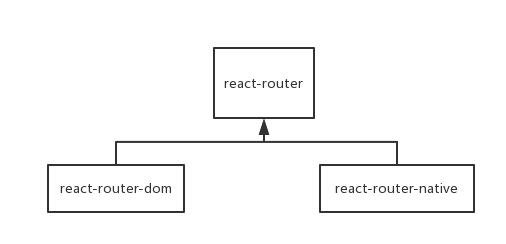

# 深入了解 React Router 原理


说到 React 我们一定离不开和 Router 打交道。不管 Vue Router 和 React Router ，他们的原理都是差不多的。这篇文章会从一个简单的例子一直拓展到真正的 React Router。

什么是路由
> 路由（routing）是指分组从源到目的地时，决定端到端路径的网络范围的进程

上面就是百度百科对路由的定义。比如我想去某个地方，那这个东西就带我去那个地方，这个东西就叫路由。

## 一个例子

先来说说需求，假设我们有两个组件 Login 和 Register，和两个对应的按钮。点击 Login 按钮就显示 Login 组件，点击 Register 显示 Register 组件。

我们这里使用 Hooks API 来创建 App 组件的自身状态。UI 代表了当前显示的是哪个组件的名字。

``` js
function Login() {
  return <div>Register</div>;
}

function Register() {
  return <div>Login</div>;
}

function App() {
  let [UI, setUI] = useState('Login');
  let onClickLogin = () => {
    setUI('Login')
  }
  let onClickRegister = () => {
    setUI('Register') 
  }
  let showUI = () => {
    switch(UI) {
      case 'Login':
        return <Login/>
      case 'Register':
        return <Register/>
    }
  }
  return (
    <div className="App">
      <button onClick={onClickLogin}>Login</button>
      <button onClick={onClickRegister}>Register</button>
      <div>
          {showUI()}
      </div>
    </div>
  );
}
```

这个其实就是路由的雏形了，每个页面对应着一个组件，然后在不同状态下去切换 。

## 使用 hash 来切换

当然我们更希望看到的是

```
不同 url -> 不同页面 -> 不同组件
```

我们先用 url 里的 hash 做尝试：

在进入页面的时候获取当前 url 的 hash 值，根据这个 hash 值去更新 UI 从而通过 showUI() 来切换到对应的组件
同时添加 onClick 事件点击不同按钮时，就在 url 设置对应的 hash，并切换对应的组件
这时候组件 App 可以写成这样：

``` js
function App() {
  // 进入页面时，先初始化当前 url 对应的组件名
  let hash = window.location.hash
  let initUI = hash === '#login' ? 'login' : 'register'

  let [UI, setUI] = useState(initUI);
  let onClickLogin = () => {
    setUI('Login')
    window.location.hash = 'login'
  }
  let onClickRegister = () => {
    setUI('Register') 
    window.location.hash = 'register'
  }
  let showUI = () => {
    switch(UI) {
      case 'Login':
        return <Login/>
      case 'Register':
        return <Register/>
    }
  }
  return (
    <div className="App">
      <button onClick={onClickLogin}>Login</button>
      <button onClick={onClickRegister}>Register</button>
      <div>
          {showUI()}
      </div>
    </div>
  );
}
```

这样其实已经满足我们的要求了，如果我在地址栏里输入 localhost:8080/#login，就会显示 <Login/>。但是这个 “#” 符号不太好看，如果输入 localhost:8080/login 就完美了。

## 使用 pathname 切换

如果要做得像上面说的那样，我们只能用 window.location.pathname 去修改 url 了。只要把上面代码里的 hash 改成 pathname 就好了，那么组件 App 可以写成这样：

``` js
function App() {
  // 进入页面时，先初始化当前 url 对应的组件名
  let pathname = window.location.pathname
  let initUI = pathname === '/login' ? 'login' : 'register'

  let [UI, setUI] = useState(initUI);
  let onClickLogin = () => {
    setUI('Login')
    window.location.pathname = 'login'
  }
  let onClickRegister = () => {
    setUI('Register') 
    window.location.pathname = 'register'
  }
  let showUI = () => {
    switch(UI) {
      case 'Login':
        return <Login/>
      case 'Register':
        return <Register/>
    }
  }
  return (
    <div className="App">
      <button onClick={onClickLogin}>Login</button>
      <button onClick={onClickRegister}>Register</button>
      <div>
          {showUI()}
      </div>
    </div>
  );
}
```

但是这里有个问题，每次修改 pathname 的时候页面会刷新，这是完全不符合我们的要求的，还不如用 hash 好。

## 使用 history 切换

幸运的是 H5 提供了一个好用的 history API，使用 window.history.pushState() 使得我们即可以修改 url 也可以不刷新页面，一举两得。

现在只需要修改点击回调里的 window.location.pathname = 'xxx' 就可以了，用 window.history.pushState() 去代替。

``` js
function App() {
  // 进入页面时，先初始化当前 url 对应的组件名
  let pathname = window.location.pathname
  let initUI = pathname === '/login' ? 'login' : 'register'

  let [UI, setUI] = useState(initUI);
  let onClickLogin = () => {
    setUI('Login')
    window.history.pushState(null, '', '/login')
  }
  let onClickRegister = () => {
    setUI('Register') 
    window.history.pushState(null, '', '/register')
  }
  let showUI = () => {
    switch(UI) {
      case 'Login':
        return <Login/>
      case 'Register':
        return <Register/>
    }
  }
  return (
    <div className="App">
      <button onClick={onClickLogin}>Login</button>
      <button onClick={onClickRegister}>Register</button>
      <div>
          {showUI()}
      </div>
    </div>
  );
}
```

到此，一个 Router 就已经被我们实现了。当然这个 Router 功能不多，不过这就是 Vue Router 和 React Router 的思想，他们是基于此来开发更多的功能而已。

约束
在前端使用路由要有个前提，那就是后端要将全部的路径都指向首页，即 index.html。否则后端会出现 404 错误。

什么叫全部路径都指向首页呢？我们想一下正常的多页网页是怎么样的：如果访问了一个不存在的路径，如 localhost:8080/fuck.html，那么后端会返回一个 error.html，里面内容显示 “找不到网页”，这种情况就是后端处理网页的路由了。因为正是后端根据不同 url 返回不同的 xxx.html 呀。

如果前端使用路由，那么后端将全部路径都指向 index.html。当我们访问到一个不存在路径时，如 localhost:8080/fuck，后端不管三七二十一返回 index.html。但是这个 index.html 里有我们写的 JS 代码（React 打包后的）呀，这 JS 代码其中就包含了我们做的路由。所以我们的路由发现不存在这个路径时，就切换到 Error 组件来充当 “找不到网页” 的 HTML 文件。这就叫前端控制路由。

React Router
现在我们使用 React Router 来重写这个代码。看官网的时候一定要看这个官网，别看 Github 的那个，因为那个是 v3.0 的。

react-router 和 react-router-dom
先说说这两个鬼的不同。当我还是先手的时候总是被这两个东西搞蒙。

react-router: 实现了路由的核心功能。
react-router-dom: 基于react-router，加入了在浏览器运行环境下的一些功能。

说到底就是 react-router-dom 是 react-router 的加强版呗。那为毛不两个合在一起呢？像 Vue Router 那样多好。因为 React Native 也要路由系统呀。所以还有一个库叫 react-router-native，这个库也是基于 react-router 的，它类似 react-router-dom，加入了 React Native 运行环境下的一些功能。关系图如下：



所以我们写网站的时候一般引入 react-router-dom 就可以了。

重构
使用了 React Router 之后代码就可以精简成下面这样了。

``` js
import { BrowserRouter as Router, Route, Link } from "react-router-dom";

function Login() {
  return <div>Register</div>;
}

function Register() {
  return <div>Login</div>;
}

function App() {
  return (
    <Router>
        <div className="App">
            <Link to="/login">Login</Link>
            <Link to="/register">Register</Link>

            <Route path="/login" component={Login}></Route>
            <Route path="/register" component={Register}></Route>
        </div>
    </Router>
  );
}
```

可以看到 React Router 帮我们做了很多的事。比如正则的匹配，路由的切换等等。更多的用法就看上面的那个官网就可以了。


## 参考资料

* [深入了解 React Router 原理][1]
* [React-Router 源码解析][2]
* [你不知道的 React Router 4][3]

[1]: https://www.jianshu.com/p/53dc287a8020
[2]: https://juejin.im/post/5b8251abf265da43606e9e70
[3]: https://zhuanlan.zhihu.com/p/28585911